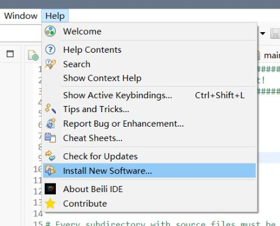
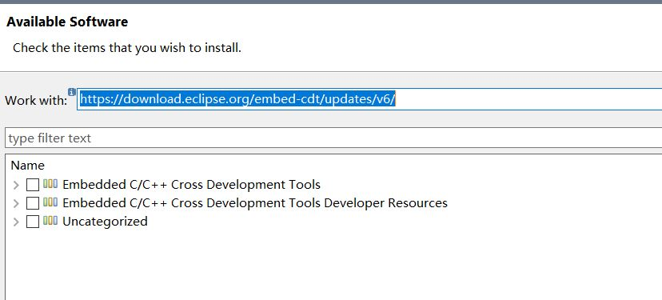
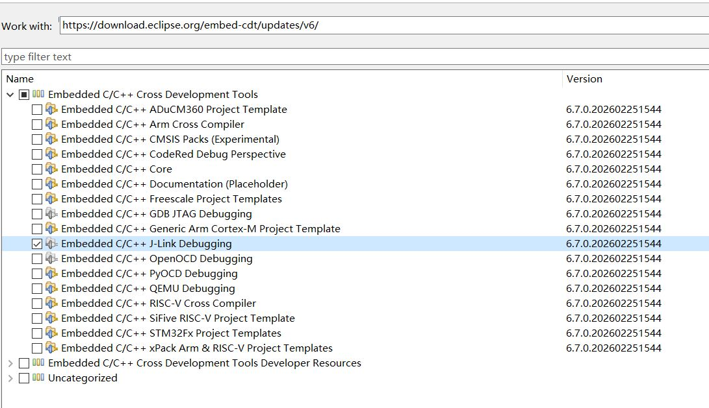
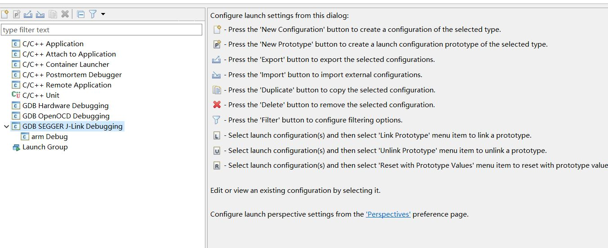
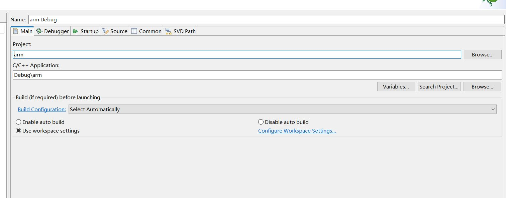
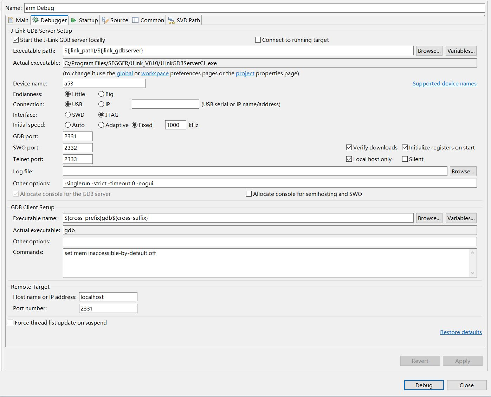

在Eclipse中安装Jlink Debugging插件，实现使用jlink debug的简易操作

# 安装教程  
- Help --> Install New Software  

- 在work with中填入插件地址：https://download.eclipse.org/embed-cdt/updates/v6/

- 在Embedded C/C++ Cross Development Tools选项下选择Jlink Debugging插件，**不需要的插件尽量不要安装**，减少下载时间

- 点击NEXT进行安装，跟随指引安装即可

# 使用教程  
安装Jlink Debugging插件后，在Debug Config选项卡中会出现GDB SEGGER J-Link Debugging选项
1. 新建GDB SEGGER J-Link Debugging配置  

2. 各配置选项简要说明  
    - MAIN  
        1. Project：选择一个工程
        2. C/C++ Application：选择一个应用(xxx.elf);不选时可能会报错，无法启动debug，推荐选择
        3. 可以选择debug前自动编译，或者关闭自动编译
        
    - Debugger  
        1. J-Link GDB Server Setup
            - 注意Actual executable的路径，一定要指向实际的JLinkGDBServerCL.exe的路径
            - Device Name必须指定，**在添加自定义设备后**，可使用自定义的设备名称
            - 其它选项自行注意
        2. GDB Clint Setup
            - 注意Actual executable的路径，指向对应的gdb
        

    - 其它选项不再说明

# Jlink自定义设备  
自定义设备参考链接https://blog.baimochun.xyz/2026/08/14/JFlash-OpenFlashLoader/

