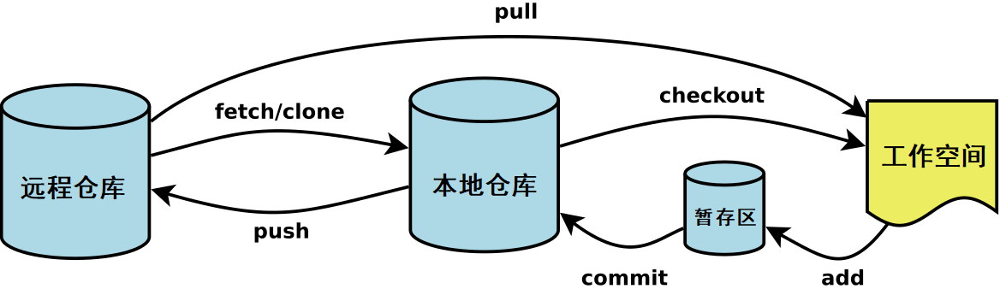

## clone
- ssh：注意ssh端口号和http端口号（当http端口号错误时，会丢失hooks，导致后续commit时无法生成id）
```
git clone "ssh://gonghaoqiang@192.168.200.133:29418/test" && (cd "test" && mkdir -p `git rev-parse --git-dir`/hooks/ && curl -Lo `git rev-parse --git-dir`/hooks/commit-msg http://192.168.200.133:8080/tools/hooks/commit-msg && chmod +x `git rev-parse --git-dir`/hooks/commit-msg)
```
- http：同样注意端口号，避免clone后出现异常

## push
- push流程
```
git add xxxfile
git commit -m "commit msg"
git push origin HEAD:refs/for/master
git push origin HEAD:refs/for/beta
```
# 撤销命令git restore
## 撤销index （git add）
工作区的文件加入暂存区后，从暂存区撤回，回到工作区，文件修改保留

```git restore --staged reset_test.txt```

```bash
raco@ubuntu:/home/terra/gerrit_rep/test$ git status 未跟踪文件
On branch master
Your branch is up to date with 'origin/master'.

Untracked files:
  (use "git add <file>..." to include in what will be committed)
        reset_test.txt

nothing added to commit but untracked files present (use "git add" to track)
raco@ubuntu:/home/terra/gerrit_rep/test$ git add . 将文件加入暂存区
raco@ubuntu:/home/terra/gerrit_rep/test$ git status
On branch master
Your branch is up to date with 'origin/master'.

Changes to be committed:
  (use "git restore --staged <file>..." to unstage)
        new file:   reset_test.txt

raco@ubuntu:/home/terra/gerrit_rep/test$ git restore --staged reset_test.txt    撤回跟踪，文件从暂存区撤回，回到工作区，文件内容保留
raco@ubuntu:/home/terra/gerrit_rep/test$ git status
On branch master
Your branch is up to date with 'origin/master'.

Untracked files:
  (use "git add <file>..." to include in what will be committed)
        reset_test.txt

nothing added to commit but untracked files present (use "git add" to track)
raco@ubuntu:/home/terra/gerrit_rep/test$ 

```
## 撤销工作区修改
只能用于被跟踪的文件，用暂存区覆盖工作区
```
git restore ./reset_test.txt
```

```bash
raco@ubuntu:/home/terra/gerrit_rep/test$ cat reset_test.txt 原始文件内容123
123
raco@ubuntu:/home/terra/gerrit_rep/test$ git status 文件在暂存区中
On branch master
Your branch is up to date with 'origin/master'.

Changes to be committed:
  (use "git restore --staged <file>..." to unstage)
        new file:   reset_test.txt

raco@ubuntu:/home/terra/gerrit_rep/test$ cat reset_test.txt 修改文件内容为456
456
raco@ubuntu:/home/terra/gerrit_rep/test$ git status 文件修改
On branch master
Your branch is up to date with 'origin/master'.

Changes to be committed:
  (use "git restore --staged <file>..." to unstage)
        new file:   reset_test.txt

Changes not staged for commit:
  (use "git add <file>..." to update what will be committed)
  (use "git restore <file>..." to discard changes in working directory)
        modified:   reset_test.txt

raco@ubuntu:/home/terra/gerrit_rep/test$ git restore ./reset_test.txt   撤销工作区修改，暂存区的内容覆盖工作区的内容
raco@ubuntu:/home/terra/gerrit_rep/test$ cat reset_test.txt     文件恢复原始状态
123
raco@ubuntu:/home/terra/gerrit_rep/test$ 
```

## git reset
- 移动头指针，暂存区和工作区保留  
    1. 当push到gerrit被abandon后，可执行reset，修改后重新add commmit push
```
git reset --soft HEAD~1
```


