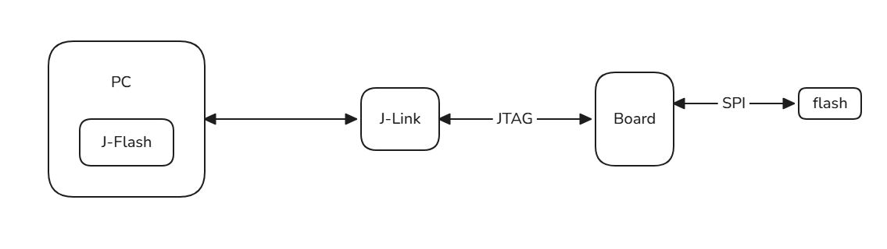
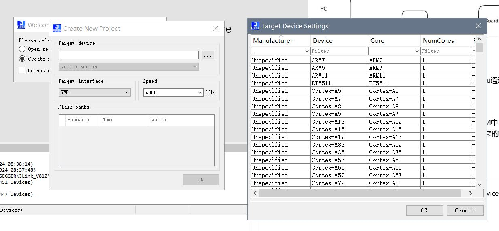
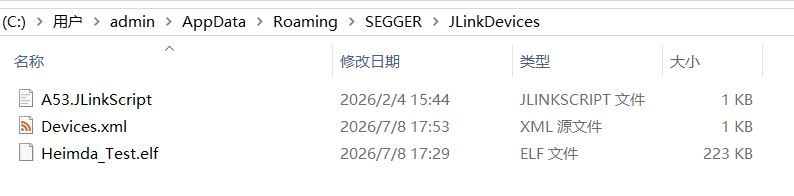

J-Flash是SEGGER推出的通过J-Link对Flash进行烧录的工具，内置多款主流芯片和存储器。且支持自定义芯片和烧录算法，提供了高灵活性

## 使用说明

目标：通过自定义设备和烧录算法，实现对片外Flash的编程

### J-Flash基本原理



主机端运行J-Flash，通过J-Link作为硬件桥梁，控制目标板上的cpu通过spi，qspi等方式对外部flash进行编程

- PC上通过J-Flash的图形界面下达烧录指令
- J-Flash会通过J-Link，将flash烧录算法下载到Board上的RAM中
- J-Flash通过J-Link控制CPU，将PC端传输过来的数据，逐步写入到flash中

### 添加自定义设备

在运行segger jlink，jflash等软件时，一般都会需要选择Target Device。


实现参考[J-Link_Device_Support_Kit](https://kb.segger.com/J-Link_Device_Support_Kit)

1. 文件等存放路径 C:\Users\<USER>\AppData\Roaming\SEGGER\JLinkDevices\
当C:\Users\<USER>\AppData\Roaming\SEGGER目录下没有JLinkDevices目录时建立目录即可

2. 在JLinkDevices下建立Devices.xml文件，示例如下
```
<Database>
  <Device>
    <ChipInfo Vendor="SEGGER" Name="SEGGER_Device0" Core="JLINK_CORE_CORTEX_M0"/>
  </Device>
  <Device>
    <ChipInfo Vendor="SEGGER" Name="SEGGER_Device1" Core="JLINK_CORE_CORTEX_M4"/>
  </Device>
</Database>
```

3. 当需要J-Link script file时，在xml中指定(JLinkScriptFile="SEGGER/Example.jlinkscript")，示例如下
```
<Database>
  <Device>
    <ChipInfo Vendor="SEGGER" Name="SEGGER_Device0" Core="JLINK_CORE_CORTEX_M0" JLinkScriptFile="SEGGER/Example.jlinkscript"/>
  </Device>
</Database>
```

4. 指定flash信息和对应的烧录算法，示例如下
```
<Database>
  <Device>
    <ChipInfo Vendor="SEGGER" Name="SEGGER_Device0" WorkRAMAddr="0x20000000" WorkRAMSize="0x8000" Core="JLINK_CORE_CORTEX_M4" />
    <FlashBankInfo Name="Internal code flash" BaseAddr="0x08000000" AlwaysPresent="1" >
      <LoaderInfo Name="Default" MaxSize="0x80000" Loader="Flashloader_Device0_InternalCodeFlash.elf" LoaderType="FLASH_ALGO_TYPE_OPEN" />
    </FlashBankInfo>
  </Device>
</Database>
```

5. 示例
```
<Database>
  <Device>
    <ChipInfo Vendor="Heimda" Name="Heimda" WorkRAMAddr="0x2000000" WorkRAMSize="0x100000" Core="JLINK_CORE_CORTEX_A53" JLinkScriptFile="A53.jlinkscript" />
    <FlashBankInfo Name="AT25DQ041" BaseAddr="0x00000000" AlwaysPresent="1" >
      <LoaderInfo Name="SPI0 FLASH" MaxSize="0x100000" Loader="Heimda_Test.elf" LoaderType="FLASH_ALGO_TYPE_OPEN" />
    </FlashBankInfo>

    <FlashBankInfo Name="AT25DQ041" BaseAddr="0x00000000" AlwaysPresent="1" >
      <LoaderInfo Name="SPI1 FLASH" MaxSize="0x100000" Loader="Heimda_Test.elf" LoaderType="FLASH_ALGO_TYPE_OPEN" />
    </FlashBankInfo>
  </Device>
</Database>
```


### Open Flash Loader 

[flash下载算法实现参考](https://kb.segger.com/SEGGER_Flash_Loader)
我们通过Open Flash Loader示例进行修改，实现自定义flash下载算法

[工程示例](https://github.com/404Zen/SFL/tree/master)

1. 需要实现指定的函数功能
2. 需要按照指定的代码布局进行链接
3. 注意变量的类型，在变量类型不对时可能出现奇怪的问题
```
struct FlashDevice  {
  uint16_t AlgoVer;
  uint8_t  Name[128];
  uint16_t Type;                    // Flash device type. Currently ignored. Set to 1 to get max. compatibility.
  uint32_t BaseAddr;                // Flash base address. It is recommended to always use the real address of the flash here, even if the flash is also available at other addresses (via an alias / remap), depending on the current settings of the device.
  uint32_t TotalSize;               // Total flash device size in bytes.
  uint32_t PageSize;                // This field describes in what chunks J-Link feeds the flash loader.
  uint32_t Reserved;                // 	Set this element to 0
  uint8_t  ErasedVal;               // Most flashes have an erased value of 0xFF (set this element to 0xFF in such cases).
  uint32_t TimeoutProg;             // Timeout in milliseconds (ms) to program one chunk of <PageSize>.
  uint32_t TimeoutErase;            // Timeout in milliseconds (ms) to erase one sector.
  struct SECTOR_INFO SectorInfo[MAX_NUM_SECTORS];       // 	This element is actually a list of different sector sizes present on target flash.Having a flash with uniform sectors will result in only SectorInfo[0] being used for sectorization information.
};
```
