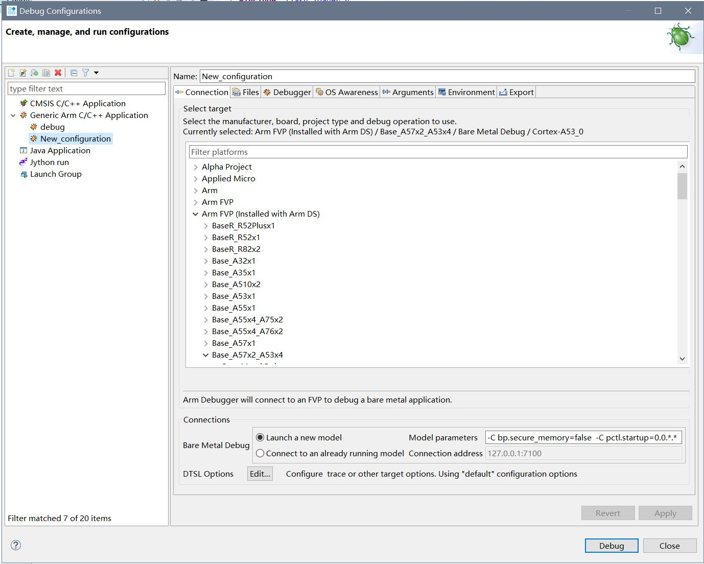
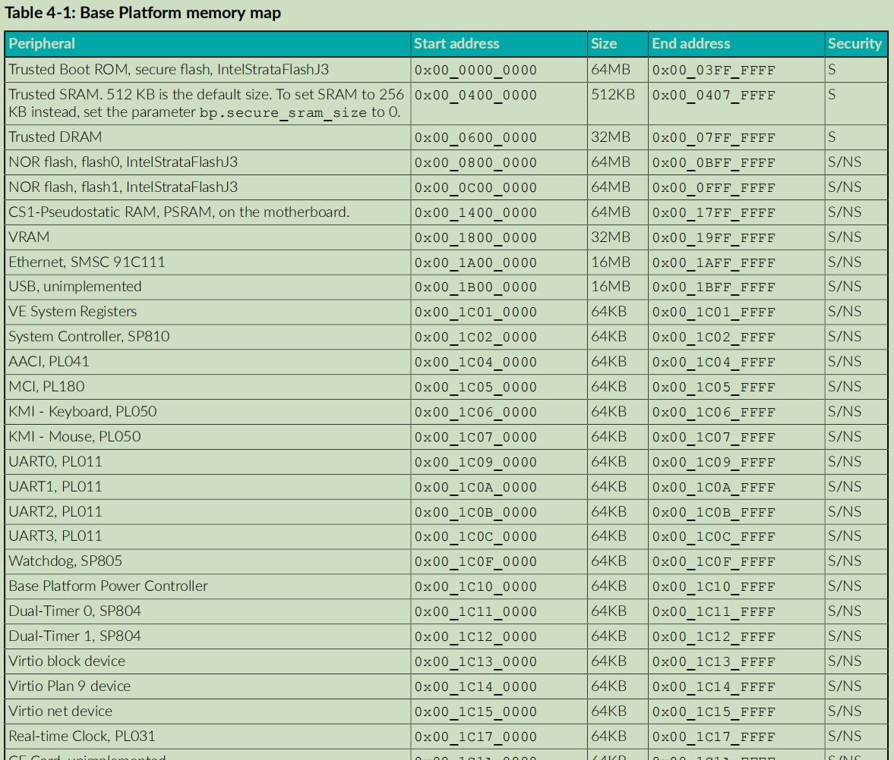
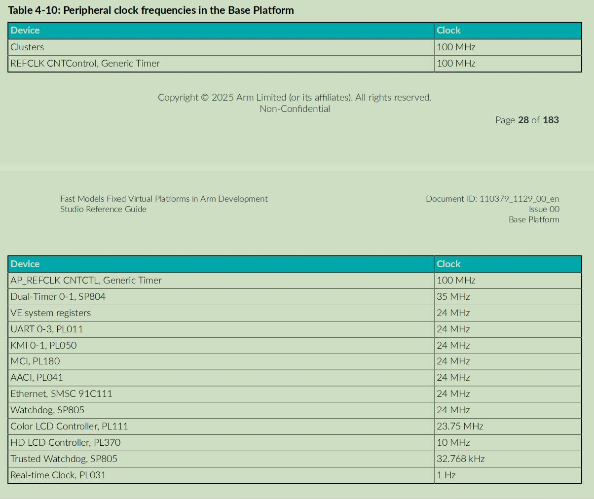

Arm FVP（Fixed Virtual Platform，固定虚拟平台）是 Arm 官方提供的预配置仿真模型

# 核心特点
- 不追求模拟硬件晶体管的行为
- 仅保证功能精确，确保代码在FVP上跑出的逻辑结果与在真实硬件上一致
- 牺牲时序精度，换取运行速度

# FVP
- 由ARM预先配置好，开箱即用
- 因已经预先配置，所有配置比较固定

# 使用
## ARM Development Studio
- 安装ARM Development Studio后，伴有部分FVP可直接使用
    
- 注意配置模型参数，有些内存不能在非安全模式访问-C bp.secure_memory=false，多核的一些模型可能需要配置上电 -C pctl.startup=0.0.*.* 

## Platform memory map
- 相关内存布局可在[fast_models_fixed_virtual_platforms_in_arm_development_studio_reference_guide_110379_1129_00_en.pdf](https://documentation-service.arm.com/static/682759818f79851ff2c3ea3c)中找到

## Clocks

## 串口
- FVP中带有串口，使用时需要进行初始化，串口输出会通过talent输出

## 运行linux
- 官方说明可以在FVP中运行linux
- 未尝试
