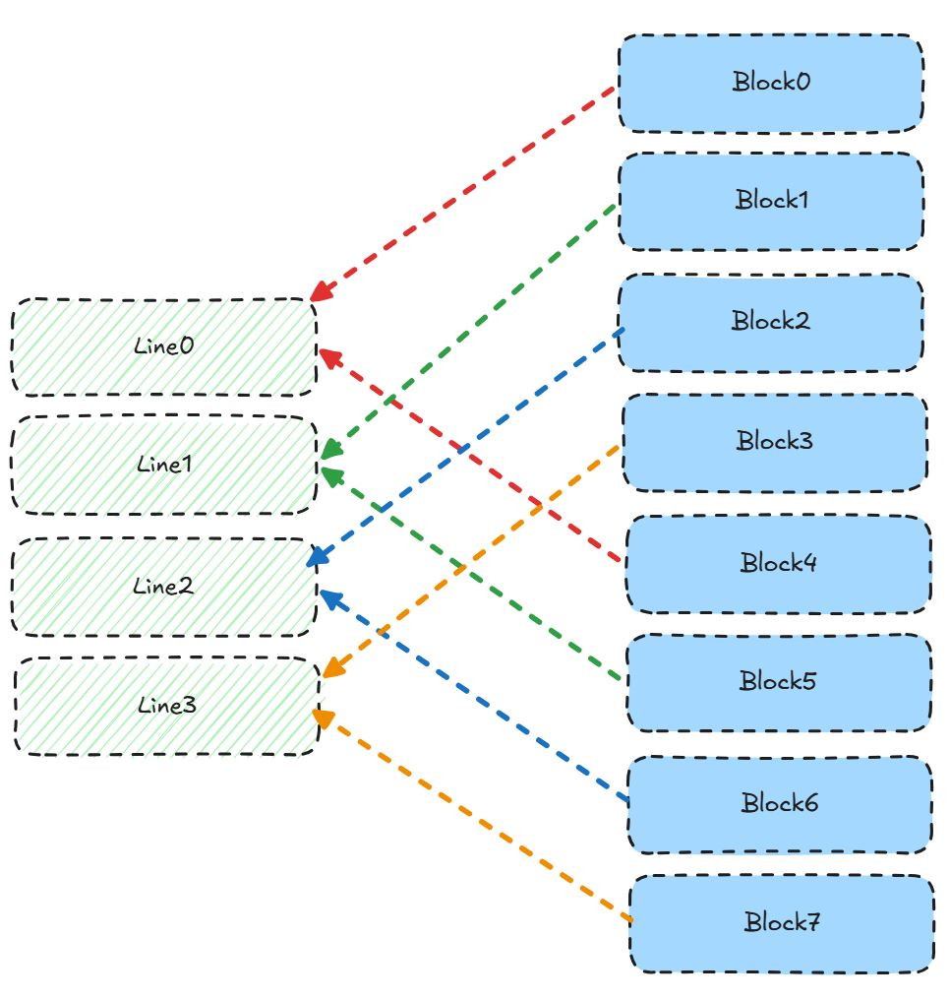
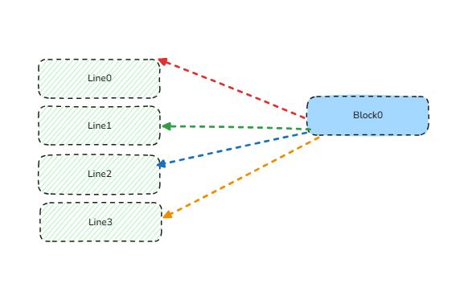
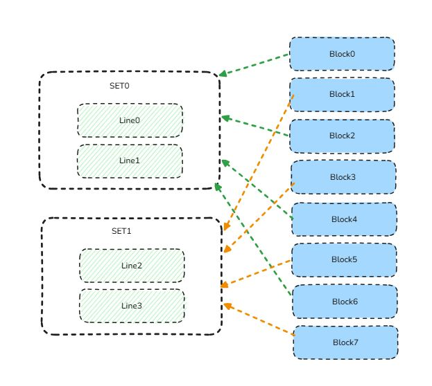
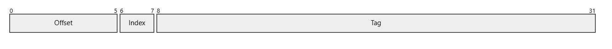
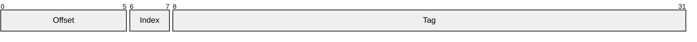
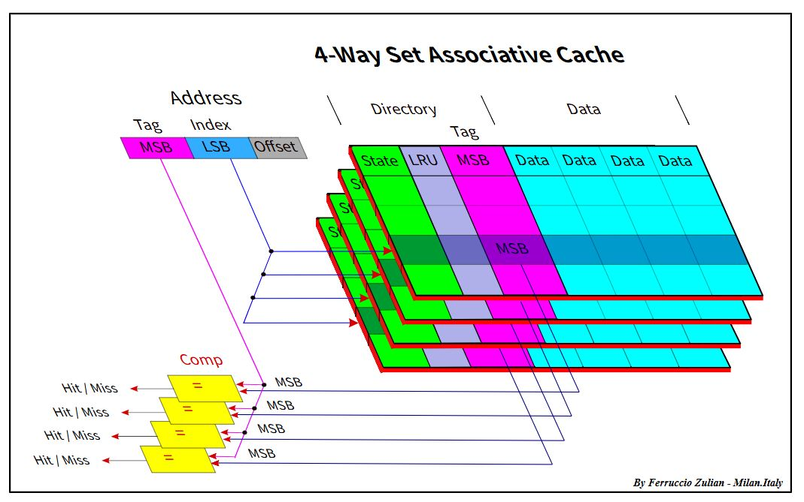

# 基础概念
- MemAddr:内存地址（虚拟地址或物理地址）
- BlockSize：块大小，cache与主存交换的最小单位
- BlockAddr：块地址，BlockAddr = MemAddr / BlockSize
- NumLines：cache line的总行数

# 一次读/写访问的标准流程
不管直接映射、全相联、组相联，流程本质都相同，只是要检查的行数不同：
- 计算块地址：把地址按块大小折算成“这是第几个块”
- 根据映射方式定位候选位置：
    1. 直接映射：候选=1行
    2. 全相联：候选 = 全部行
    3. 组相联：候选 = 1组内的k行
- 命中判定：候选行valid=1且tag匹配则hit，否则miss

# 直接映射
- 每一个内存块都映射到一个cache行
- LineIndex（映射的cache行号） = BlockAddr mod NumLines



# 全相联映射
- 任意内存块可以映射到任意cache行


# 组相联映射
- 将cache进行分组，一组包含多个cache行
- 内存块以直接映射的形式，先映射到对应的组上
- 然后以全相联的方式，映射到组内的cache行
- 2way set，一组中有两个cacheline
    

# CacheLine
cachekline里通常有什么
- valid位：这行中有没有有效数据
- tag：这行装的是哪个主存块
- data：真正的数据块
- dirty：write-back时，标记数据是否被修改过
- 替换信息：用于cacheline的替换

# 虚拟、物理地址内部划分
以Block size：64B，way = 4为例






# cache命中缺失流程
```text
CPU 发起一次访存（给你一个地址 Addr）
                |
                v
      按块大小切：BlockAddr = floor(Addr / BlockSize)
                |
                v
      按映射方式定位候选位置（行/组）：
        - 直接映射：LineIndex = BlockAddr mod NumLines
        - 组相联：  SetIndex  = BlockAddr mod NumSets（组内 k 路都要查）
        - 全相联：  候选 = 全部行
                |
                v
      在候选行里做命中判定：
        若存在某行：Valid=1 且 Tag 匹配  --->  HIT
        否则                              --->  MISS
         |                                     |
         |                                     v
         |                           选空行或按替换策略挑 victim
         |                                     |
         |                      (若 write-back 且 victim Dirty=1 则先写回)
         |                                     |
         |                                     v
         |                           从主存取目标块，装入 Cache
         |                                     |
         v                                     v
  用 Offset 取块内数据/完成读写          重新访问（这次通常会 hit）

```


