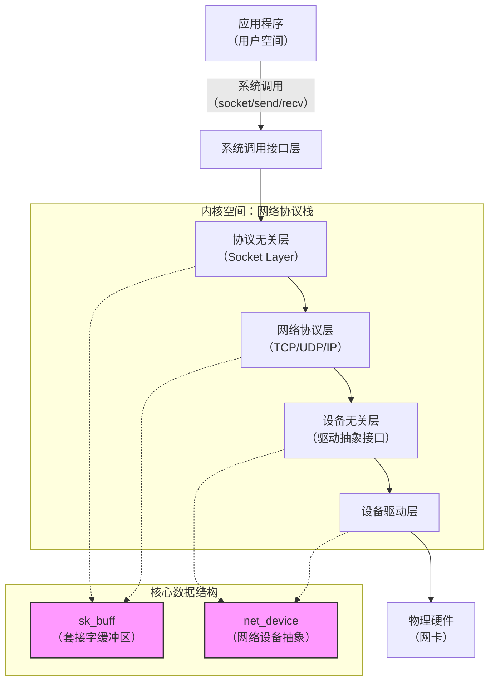
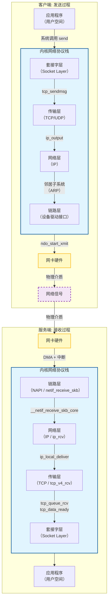
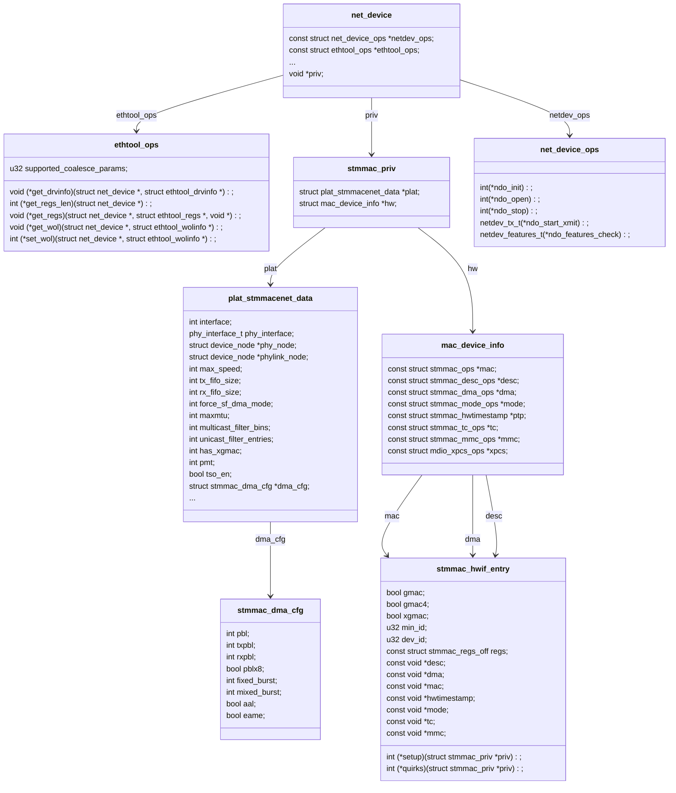
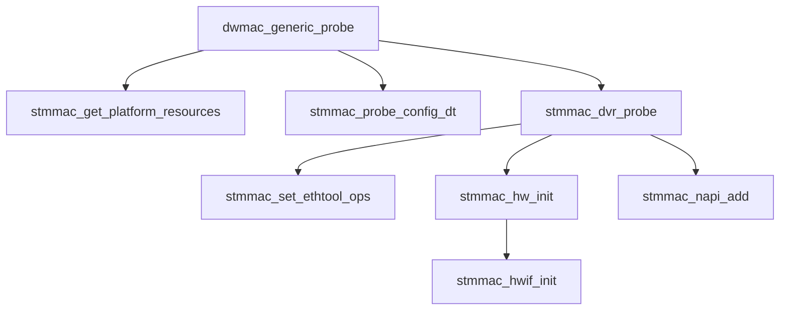

# 环境
1. linux version: 5.10.237
2. 以太网驱动：stmmac xgmac（dw xgmac）

# 内核网络协议栈架构




- 系统分层
    1. **系统调用接口层**：用户程序进入内核的唯一入口。应用程序通过Socket API发起网络操作，触发系统调用，进入内核协议栈
    2. **协议无关层**：向上层提供统一的接口，向下屏蔽具体的传输协议差异
    3. **网络协议层**：这是协议栈的核心，负责实现各种网络协议。它包含传输层的TCP、UDP和网络层的IP、ICMP等。在这一层，数据包被封装或解封装，并执行路由查找、分片重组等关键操作
    4. **设备无关层**：这一层提供了一个统一的接口来访问底层不同的网卡驱动程序。它通过net_device结构体将各种硬件的差异抽象为open, close, init等标准操作，使得网络协议层无需关心具体物理硬件的细节
    5. **设备驱动层**：这是直接与硬件交互的层。驱动程序实现了对具体网卡的控制，负责初始化硬件、发送和接收数据包，并响应硬件中断
- 两大核心数据结构
    1. **sk_buff**（套接字缓冲区）：这是贯穿协议栈各层的数据包载体。它本身不存储数据包内容，而是通过head, data, tail, end四个指针来管理实际的数据缓冲区。当数据在协议栈中向上或向下传递时，内核只需移动data和tail指针来添加或剥离协议头，从而避免了昂贵的数据拷贝操作。此外，它还包含mac_header, network_header等指针，直接指向各层协议的头部，方便协议栈快速定位和解析
    2. **net_device**（网络设备抽象）：这是内核中代表一个网络设备的数据结构。无论是物理网卡还是虚拟设备（如环路接口、VLAN），在Linux内核中都以一个net_device结构来表示。所有设备的net_device结构通过链表（由全局变量dev_base指向）组织在一起。这个结构体包含了设备的所有信息（如名称、中断号、硬件地址）以及一系列操作函数指针（如netdev_ops），是驱动与协议栈交互的核心

# 报文处理流程


## 发送路径
1. 应用发起：用户程序调用 send 系统调用，进入内核。
1. 套接字与传输层：内核通过套接字层找到对应的连接，并调用 tcp_sendmsg（以TCP为例）。TCP层负责将用户数据按MSS分段，并添加TCP头部。
1. 网络层：ip_output 函数添加IP头部，并通过路由表查找决定从哪个网卡发出。
1. 链路层与驱动：通过邻居子系统（ARP） 获取目标MAC地址，封装成以太网帧。最终调用网卡驱动的 ndo_start_xmit 函数。
1. 硬件发送：驱动将数据包放入网卡的DMA发送队列，网卡将其转换为电信号/光信号从物理介质发出。

## 接收路径
1. 硬件接收：网卡收到信号，还原为数据帧，通过DMA直接写入内存的Ring Buffer，然后触发硬件中断。
1. NAPI与链路层：中断上半部触发 NET_RX_SOFTIRQ 软中断。软中断中，net_rx_action 调用驱动的 poll 函数，从Ring Buffer批量取出数据包，并通过 netif_receive_skb 送入协议栈。
1. 链路层分发：__netif_receive_skb_core 根据以太网头中的类型（如 ETH_P_IP）在 ptype_base 哈希表中找到 ip_rcv，将数据包分发给IP层。
1. IP层处理：ip_rcv 函数进行校验和检查，通过 ip_route_input_noref 做路由决策，确认是发往本机的包后，交给 ip_local_deliver。IP层根据协议号（如TCP是6）在 inet_protos 中找到 tcp_v4_rcv，进行分发。
1. TCP层处理：tcp_v4_rcv 通过四元组查找对应的 struct sock。数据通过 tcp_queue_rcv 放入套接字的接收队列，并调用 tcp_data_ready 通知上层。
1. 唤醒与读取：tcp_data_ready 唤醒阻塞在 recv 上的用户进程。进程被调度后，系统调用 recv 进入内核，执行 tcp_recvmsg，通过 skb_copy_datagram_msg 将内核数据拷贝到用户空间缓冲区，最终返回。

# stmmac驱动分析 （包含dwxgmac）
驱动路径
```bash
linux/drivers/net/ethernet/stmicro/stmmac
```

## 核心数据结构



### stmmac_ethtool_ops  
```c
static const struct ethtool_ops stmmac_ethtool_ops = {
    .supported_coalesce_params = ETHTOOL_COALESCE_USECS |
                    ETHTOOL_COALESCE_MAX_FRAMES,
    .begin = stmmac_check_if_running,
    .get_drvinfo = stmmac_ethtool_getdrvinfo,
    .get_msglevel = stmmac_ethtool_getmsglevel,
    .set_msglevel = stmmac_ethtool_setmsglevel,
    .get_regs = stmmac_ethtool_gregs,
    .get_regs_len = stmmac_ethtool_get_regs_len,
    .get_link = ethtool_op_get_link,
    .nway_reset = stmmac_nway_reset,
    .get_ringparam = stmmac_get_ringparam,
    .set_ringparam = stmmac_set_ringparam,
    .get_pauseparam = stmmac_get_pauseparam,
    .set_pauseparam = stmmac_set_pauseparam,
    .self_test = stmmac_selftest_run,
    .get_ethtool_stats = stmmac_get_ethtool_stats,
    .get_strings = stmmac_get_strings,
    .get_wol = stmmac_get_wol,
    .set_wol = stmmac_set_wol,
    .get_eee = stmmac_ethtool_op_get_eee,
    .set_eee = stmmac_ethtool_op_set_eee,
    .get_sset_count	= stmmac_get_sset_count,
    .get_rxnfc = stmmac_get_rxnfc,
    .get_rxfh_key_size = stmmac_get_rxfh_key_size,
    .get_rxfh_indir_size = stmmac_get_rxfh_indir_size,
    .get_rxfh = stmmac_get_rxfh,
    .set_rxfh = stmmac_set_rxfh,
    .get_ts_info = stmmac_get_ts_info,
    .get_coalesce = stmmac_get_coalesce,
    .set_coalesce = stmmac_set_coalesce,
    .get_channels = stmmac_get_channels,
    .set_channels = stmmac_set_channels,
    .get_tunable = stmmac_get_tunable,
    .set_tunable = stmmac_set_tunable,
    .get_link_ksettings = stmmac_ethtool_get_link_ksettings,
    .set_link_ksettings = stmmac_ethtool_set_link_ksettings,
};

```
核心功能是将驱动内部的控制、配置和统计信息，通过标准的 ethtool 用户空间工具暴露给系统管理员和开发者
1. 信息查询与诊断
    - 驱动信息 (get_drvinfo)：提供驱动名称、版本、总线信息等，用于快速确认当前运行的驱动版本。
    - 寄存器转储 (get_regs, get_regs_len)：允许将网卡硬件寄存器的当前值读取出来，这对于底层驱动开发和硬件故障调试非常重要。
    - 扩展统计信息 (get_ethtool_stats, get_strings, get_sset_count)：获取驱动和硬件维护的详细统计计数器，例如各种错误包计数、丢包原因等，远超 ifconfig 提供的常规统计。
    - 自检功能 (self_test)：触发网卡硬件执行内置的自检流程，用于初步判断硬件是否存在故障。
2. 运行时参数调整
    - 环参数 (get_ringparam, set_ringparam)：查询和修改 DMA 接收/发送环形缓冲区的大小，以应对不同的流量模式
    - 通道数量 (get_channels, set_channels)：调整网卡多队列（Multi-Queue）的 RX/TX 队列数量，以更好地利用多核 CPU 的性能
    - 唤醒功能 (get_wol, set_wol)：配置“网络唤醒”（Wake-on-LAN）功能，使网卡能在收到特定魔术包时唤醒系统
3. 高级特性配置与调试
    - EEE（节能以太网）配置 (get_eee, set_eee)：在支持低功耗以太网（IEEE 802.3az）的硬件上，查询或开启/关闭此节能功能
    - 时间戳 (get_ts_info)：查询网卡硬件时间戳能力，这对于 PTP（精确时间协议）等需要高精度时间同步的应用至关重要

### stmmac_hw[]
STMMAC 驱动实现硬件抽象与版本适配的核心数据结构，通过查找表将驱动通用代码与不同版本的Synopsys的以太网MAC控制器的具体操作函数解耦。


```c
static const struct stmmac_hwif_entry {
    bool gmac;
    bool gmac4;
    bool xgmac;
    u32 min_id;
    u32 dev_id;
    const struct stmmac_regs_off regs;
    const void *desc;
    const void *dma;
    const void *mac;
    const void *hwtimestamp;
    const void *mode;
    const void *tc;
    const void *mmc;
    int (*setup)(struct stmmac_priv *priv);
    int (*quirks)(struct stmmac_priv *priv);
} stmmac_hw[] = {
    /* NOTE: New HW versions shall go to the end of this table */
    {
        .gmac = false,
        .gmac4 = false,
        .xgmac = false,
        .min_id = 0,
        .regs = {
            .ptp_off = PTP_GMAC3_X_OFFSET,
            .mmc_off = MMC_GMAC3_X_OFFSET,
        },
        .desc = NULL,
        .dma = &dwmac100_dma_ops,
        .mac = &dwmac100_ops,
        .hwtimestamp = &stmmac_ptp,
        .mode = NULL,
        .tc = NULL,
        .mmc = &dwmac_mmc_ops,
        .setup = dwmac100_setup,
        .quirks = stmmac_dwmac1_quirks,
    }, {
        .gmac = true,
        .gmac4 = false,
        .xgmac = false,
        .min_id = 0,
        .regs = {
            .ptp_off = PTP_GMAC3_X_OFFSET,
            .mmc_off = MMC_GMAC3_X_OFFSET,
        },
        .desc = NULL,
        .dma = &dwmac1000_dma_ops,
        .mac = &dwmac1000_ops,
        .hwtimestamp = &stmmac_ptp,
        .mode = NULL,
        .tc = NULL,
        .mmc = &dwmac_mmc_ops,
        .setup = dwmac1000_setup,
        .quirks = stmmac_dwmac1_quirks,
    }, {
        .gmac = false,
        .gmac4 = true,
        .xgmac = false,
        .min_id = 0,
        .regs = {
            .ptp_off = PTP_GMAC4_OFFSET,
            .mmc_off = MMC_GMAC4_OFFSET,
        },
        .desc = &dwmac4_desc_ops,
        .dma = &dwmac4_dma_ops,
        .mac = &dwmac4_ops,
        .hwtimestamp = &stmmac_ptp,
        .mode = NULL,
        .tc = &dwmac510_tc_ops,
        .mmc = &dwmac_mmc_ops,
        .setup = dwmac4_setup,
        .quirks = stmmac_dwmac4_quirks,
    }, {
        .gmac = false,
        .gmac4 = true,
        .xgmac = false,
        .min_id = DWMAC_CORE_4_00,
        .regs = {
            .ptp_off = PTP_GMAC4_OFFSET,
            .mmc_off = MMC_GMAC4_OFFSET,
        },
        .desc = &dwmac4_desc_ops,
        .dma = &dwmac4_dma_ops,
        .mac = &dwmac410_ops,
        .hwtimestamp = &stmmac_ptp,
        .mode = &dwmac4_ring_mode_ops,
        .tc = &dwmac510_tc_ops,
        .mmc = &dwmac_mmc_ops,
        .setup = dwmac4_setup,
        .quirks = NULL,
    }, {
        .gmac = false,
        .gmac4 = true,
        .xgmac = false,
        .min_id = DWMAC_CORE_4_10,
        .regs = {
            .ptp_off = PTP_GMAC4_OFFSET,
            .mmc_off = MMC_GMAC4_OFFSET,
        },
        .desc = &dwmac4_desc_ops,
        .dma = &dwmac410_dma_ops,
        .mac = &dwmac410_ops,
        .hwtimestamp = &stmmac_ptp,
        .mode = &dwmac4_ring_mode_ops,
        .tc = &dwmac510_tc_ops,
        .mmc = &dwmac_mmc_ops,
        .setup = dwmac4_setup,
        .quirks = NULL,
    }, {
        .gmac = false,
        .gmac4 = true,
        .xgmac = false,
        .min_id = DWMAC_CORE_5_10,
        .regs = {
            .ptp_off = PTP_GMAC4_OFFSET,
            .mmc_off = MMC_GMAC4_OFFSET,
        },
        .desc = &dwmac4_desc_ops,
        .dma = &dwmac410_dma_ops,
        .mac = &dwmac510_ops,
        .hwtimestamp = &stmmac_ptp,
        .mode = &dwmac4_ring_mode_ops,
        .tc = &dwmac510_tc_ops,
        .mmc = &dwmac_mmc_ops,
        .setup = dwmac4_setup,
        .quirks = NULL,
    }, {
        .gmac = false,
        .gmac4 = false,
        .xgmac = true,
        .min_id = DWXGMAC_CORE_2_10,
        .dev_id = DWXGMAC_ID,
        .regs = {
            .ptp_off = PTP_XGMAC_OFFSET,
            .mmc_off = MMC_XGMAC_OFFSET,
        },
        .desc = &dwxgmac210_desc_ops,
        .dma = &dwxgmac210_dma_ops,
        .mac = &dwxgmac210_ops,
        .hwtimestamp = &stmmac_ptp,
        .mode = NULL,
        .tc = &dwmac510_tc_ops,
        .mmc = &dwxgmac_mmc_ops,
        .setup = dwxgmac2_setup,
        .quirks = NULL,
    }, {
        .gmac = false,
        .gmac4 = false,
        .xgmac = true,
        .min_id = DWXLGMAC_CORE_2_00,
        .dev_id = DWXLGMAC_ID,
        .regs = {
            .ptp_off = PTP_XGMAC_OFFSET,
            .mmc_off = MMC_XGMAC_OFFSET,
        },
        .desc = &dwxgmac210_desc_ops,
        .dma = &dwxgmac210_dma_ops,
        .mac = &dwxlgmac2_ops,
        .hwtimestamp = &stmmac_ptp,
        .mode = NULL,
        .tc = &dwmac510_tc_ops,
        .mmc = &dwxgmac_mmc_ops,
        .setup = dwxlgmac2_setup,
        .quirks = stmmac_dwxlgmac_quirks,
    },
};
```
1. 通过硬件版本号和设备ID进行精确匹配
2. const void *desc：描述符管理
3. const void *dma：dma控制器操作
4. const void *mac：MAC核心操作

### stmmac_netdev_ops  
STMMAC 驱动中连接 Linux 内核网络协议栈与硬件驱动的核心枢纽。它通过实现 struct net_device_ops 结构体中定义的一系列标准操作函数，使得内核协议栈能够以统一的方式控制和操作 STMMAC 网卡设备，而无需关心底层硬件的具体细节
```c
static const struct net_device_ops stmmac_netdev_ops = {
    .ndo_open = stmmac_open,
    .ndo_start_xmit = stmmac_xmit,
    .ndo_stop = stmmac_release,
    .ndo_change_mtu = stmmac_change_mtu,
    .ndo_fix_features = stmmac_fix_features,
    .ndo_set_features = stmmac_set_features,
    .ndo_set_rx_mode = stmmac_set_rx_mode,
    .ndo_tx_timeout = stmmac_tx_timeout,
    .ndo_do_ioctl = stmmac_ioctl,
    .ndo_setup_tc = stmmac_setup_tc,
    .ndo_select_queue = stmmac_select_queue,
#ifdef CONFIG_NET_POLL_CONTROLLER
    .ndo_poll_controller = stmmac_poll_controller,
#endif
    .ndo_set_mac_address = stmmac_set_mac_address,
    .ndo_vlan_rx_add_vid = stmmac_vlan_rx_add_vid,
    .ndo_vlan_rx_kill_vid = stmmac_vlan_rx_kill_vid,
};
```
1. 设备生命周期管理
    - .ndo_open = stmmac_open：当用户执行 ifconfig eth0 up 或 ip link set eth0 up 时被调用。它负责启用网卡，包括分配 DMA 缓冲区、注册中断、启动 NAPI 轮询、以及通过 PHY 库建立与物理层（PHY）芯片的连接
    - .ndo_stop = stmmac_release：当用户执行 ifconfig eth0 down 时被调用。它负责关闭网卡，执行与 ndo_open 相反的操作，如释放资源、停止 NAPI、断开 PHY 连接
2. 数据发送
    - .ndo_start_xmit = stmmac_xmit：这是数据发送的核心入口。当内核协议栈有数据包（封装在 sk_buff 中）需要发送时，会调用此函数。驱动需要在此函数中将 sk_buff 映射到 DMA 地址，并交给硬件发送。
3. 设备监控与异常处理
    - .ndo_tx_timeout = stmmac_tx_timeout：当网卡发送超时（硬件未能及时完成发送）时，内核会调用此函数。它通常负责重置硬件或重新初始化发送队列，以防止设备挂死
4. 功能特性配置
    - .ndo_change_mtu = stmmac_change_mtu：允许修改网卡的 MTU（最大传输单元） 值。
    - .ndo_set_rx_mode = stmmac_set_rx_mode：配置网卡的接收模式，例如设置混杂模式或多播列表，常用于 tcpdump 抓包或桥接等场景。
    - .ndo_set_mac_address = stmmac_set_mac_address：设置网卡的 MAC 地址。
    - .ndo_fix_features / .ndo_set_features：处理网卡硬件功能特性的变更，例如校验和卸载（NETIF_F_RXCSUM）、TSO（TCP 分段卸载）等。这些函数在启用或禁用相关硬件加速功能时被调用。
5. 高级网络支持
    - .ndo_do_ioctl = stmmac_ioctl：处理套接字的 ioctl 系统调用（如 SIOCGMIIPHY、SIOCGMIIREG），主要用于用户空间工具（如 mii-tool）访问 PHY 寄存器。

    - .ndo_setup_tc = stmmac_setup_tc：配置流量控制（Traffic Control），支持 QoS（服务质量）和硬件优先级队列。

    - .ndo_select_queue = stmmac_select_queue：当网卡支持多发送队列时，此函数决定数据包应发往哪个发送队列，通常基于 sk_buff 的优先级或哈希值。

    - .ndo_vlan_rx_add_vid / .ndo_vlan_rx_kill_vid：用于 VLAN 功能的支持，在硬件层面添加或删除 VLAN ID 的过滤规则。

    - .ndo_poll_controller：仅在 CONFIG_NET_POLL_CONTROLLER 选项启用时存在，用于在 netconsole 等场景下，禁用中断后强制轮询网卡。

## probe



### dwmac_generic_probe

```c
static const struct of_device_id dwmac_generic_match[] = {
	{ .compatible = "st,spear600-gmac"},
	{ .compatible = "snps,dwmac-3.40a"},
	{ .compatible = "snps,dwmac-3.50a"},
	{ .compatible = "snps,dwmac-3.610"},
	{ .compatible = "snps,dwmac-3.70a"},
	{ .compatible = "snps,dwmac-3.710"},
	{ .compatible = "snps,dwmac-4.00"},
	{ .compatible = "snps,dwmac-4.10a"},
	{ .compatible = "snps,dwmac"},
	{ .compatible = "snps,dwxgmac-2.10"},
	{ .compatible = "snps,dwxgmac"},
	{ }
};
MODULE_DEVICE_TABLE(of, dwmac_generic_match);

static struct platform_driver dwmac_generic_driver = {
	.probe  = dwmac_generic_probe,
	.remove = stmmac_pltfr_remove,
	.driver = {
		.name           = STMMAC_RESOURCE_NAME,
		.pm		= &stmmac_pltfr_pm_ops,
		.of_match_table = of_match_ptr(dwmac_generic_match),
	},
};
module_platform_driver(dwmac_generic_driver);
```

### stmmac_get_platform_resources
- 从设备树中获取中断，地址，存储在struct stmmac_resources *
```c
int stmmac_get_platform_resources(struct platform_device *pdev,
                struct stmmac_resources *stmmac_res)
{
    memset(stmmac_res, 0, sizeof(*stmmac_res));

    /* Get IRQ information early to have an ability to ask for deferred
    * probe if needed before we went too far with resource allocation.
    */
    stmmac_res->irq = platform_get_irq_byname(pdev, "macirq");
    if (stmmac_res->irq < 0)
        return stmmac_res->irq;

    /* On some platforms e.g. SPEAr the wake up irq differs from the mac irq
    * The external wake up irq can be passed through the platform code
    * named as "eth_wake_irq"
    *
    * In case the wake up interrupt is not passed from the platform
    * so the driver will continue to use the mac irq (ndev->irq)
    */
    stmmac_res->wol_irq =
        platform_get_irq_byname_optional(pdev, "eth_wake_irq");
    if (stmmac_res->wol_irq < 0) {
        if (stmmac_res->wol_irq == -EPROBE_DEFER)
            return -EPROBE_DEFER;
        dev_info(&pdev->dev, "IRQ eth_wake_irq not found\n");
        stmmac_res->wol_irq = stmmac_res->irq;
    }

    stmmac_res->lpi_irq =
        platform_get_irq_byname_optional(pdev, "eth_lpi");
    if (stmmac_res->lpi_irq < 0) {
        if (stmmac_res->lpi_irq == -EPROBE_DEFER)
            return -EPROBE_DEFER;
        dev_info(&pdev->dev, "IRQ eth_lpi not found\n");
    }

    stmmac_res->addr = devm_platform_ioremap_resource(pdev, 0);

    return PTR_ERR_OR_ZERO(stmmac_res->addr);
}
```
### stmmac_probe_config_dt
    - 进一步从设备树中获取信息，存储到struct plat_stmmacenet_data * 中

### stmmac_dvr_probe
    通用初始化接口，使用上面获取的信息进行初始化

### stmmac_hw_init

## open
    dma资源分配说明


# linux中断，中断嵌套  
在Linux内核中，“不支持中断嵌套”指：在当前CPU上处理一个硬件中断（即执行中断上半部/硬中断服务程序）期间，当前CPU会处于关中断状态，使得任何新的外部硬件中断都不能抢占当前正在执行的中断处理程序。新的中断请求必须等待当前ISR执行完毕后，才能在开中断时被响应和处理

## 中断上半部（Top Half）  
1. 通过 **request_irq**() 注册的那个中断服务程序（ISR）
2. 处理紧急、必须立即完成的工作。典型任务是清中断标志、读硬件寄存器、确认硬件状态
3. 硬件中断一触发，CPU立即响应并执行
4. 执行时，当前CPU中断默认是**关闭**的。所以它必须快速执行，耗时极短，否则会耽误其他中断

## 中断下半部（Bottom Half）  
1. 承接上半部来不及处理的工作而推出的后**续处理机制**
2. 处理耗时、非紧急的剩余工作。典型任务是**解析协议、把数据拷贝到用户空间、唤醒等待的进程**
3. 由上半部触发“调度”后，在更安全的时机（系统空闲或开中断时） 执行
4. 执行时**中断是开启的**，并且根据实现不同，可能在软中断，Tasklet或工作队列执行

# 中断下半部实现  
中断下半部的具体实现主要有以下三种
1. 软中断（Softirq）
2. Tasklet 
    - 基于软中断
3. 工作队列（Work Queue）
    - 将下半部任务交由内核工作线程（kworker）执行
4. 中断线程化（Threaded IRQ）
    - 不属于传统“下半部”机制

## 软中断  
- 软中断的触发  
通过raise_softirq，置标志位
    ```c
    void raise_softirq(unsigned int nr)
    {
        unsigned long flags;

        local_irq_save(flags);
        raise_softirq_irqoff(nr);
        local_irq_restore(flags);
    }
    ```
- 软中断执行
    1. 中断上半部执行结束后
    2. ksoftirqd 内核线程
    3. 进程上下文

### 软中断的执行
#### 快速路径  
每次有硬件中断，硬中断处理结束后**irq_exit**中会调用 **__do_softirq**，以riscv为例
- 调用关系
    ```text
    handle_exception
        handle_arch_irq（riscv_intc_irq）
            handle_domain_irq
                __handle_domain_irq
                    generic_handle_irq --> 硬件中断处理
                    irq_exit
                        __irq_exit_rcu
                            invoke_softirq
                                do_softirq_own_stack
                                    __do_softirq  --> 软中断处理
    ```

- linux/arch/riscv/kernel/head.S中，将**handle_exception**设置为中断和异常的入口
    ```asm
        la a0, handle_exception
        csrw CSR_TVEC, a0   // TVEC（trap vector）寄存器用于存储中断和异常的入口
    ```
- linux/arch/riscv/kernel/entry.S， **handle_exception**函数调用**handle_arch_irq**为处理中断。  
riscv_intc_init函数将**handle_arch_irq**初始化为**riscv_intc_irq**
    ```c
        static int __init riscv_intc_init(struct device_node *node,
                    struct device_node *parent)
        {
            int rc, hartid;

            hartid = riscv_of_parent_hartid(node);
            if (hartid < 0) {
                pr_warn("unable to find hart id for %pOF\n", node);
                return 0;
            }

            /*
            * The DT will have one INTC DT node under each CPU (or HART)
            * DT node so riscv_intc_init() function will be called once
            * for each INTC DT node. We only need to do INTC initialization
            * for the INTC DT node belonging to boot CPU (or boot HART).
            */
            if (riscv_hartid_to_cpuid(hartid) != smp_processor_id())
                return 0;

            intc_domain = irq_domain_add_linear(node, BITS_PER_LONG,
                                &riscv_intc_domain_ops, NULL);
            if (!intc_domain) {
                pr_err("unable to add IRQ domain\n");
                return -ENXIO;
            }

            rc = set_handle_irq(&riscv_intc_irq);

            if (rc) {
                pr_err("failed to set irq handler\n");
                return rc;
            }

            cpuhp_setup_state(CPUHP_AP_IRQ_RISCV_STARTING,
                    "irqchip/riscv/intc:starting",
                    riscv_intc_cpu_starting,
                    riscv_intc_cpu_dying);

            pr_info("%d local interrupts mapped\n", BITS_PER_LONG);

            return 0;
        }
    ```
- riscv_intc_irq函数如下，非RV_IRQ_SOFT执行**handle_domain_irq**
    ```c
        static asmlinkage void riscv_intc_irq(struct pt_regs *regs)
        {
            unsigned long cause = regs->cause & ~CAUSE_IRQ_FLAG;

            if (unlikely(cause >= BITS_PER_LONG))
                panic("unexpected interrupt cause");

            switch (cause) {
        #ifdef CONFIG_SMP
            case RV_IRQ_SOFT:
                /*
                * We only use software interrupts to pass IPIs, so if a
                * non-SMP system gets one, then we don't know what to do.
                */
                handle_IPI(regs);
                break;
        #endif
            default:
                handle_domain_irq(intc_domain, cause, regs);
                break;
            }
        }
    ```
- handle_domain_irq：generic_handle_irq处理对应的中断
    ```C
        static inline int handle_domain_irq(struct irq_domain *domain,
                            unsigned int hwirq, struct pt_regs *regs)
        {
            return __handle_domain_irq(domain, hwirq, true, regs);
        }


        int __handle_domain_irq(struct irq_domain *domain, unsigned int hwirq,
            bool lookup, struct pt_regs *regs)
        {
            struct pt_regs *old_regs = set_irq_regs(regs);
            unsigned int irq = hwirq;
            int ret = 0;

            irq_enter();

        #ifdef CONFIG_IRQ_DOMAIN
            if (lookup)
                irq = irq_find_mapping(domain, hwirq);
        #endif

            /*
            * Some hardware gives randomly wrong interrupts.  Rather
            * than crashing, do something sensible.
            */
            if (unlikely(!irq || irq >= nr_irqs)) {
                ack_bad_irq(irq);
                ret = -EINVAL;
            } else {
                generic_handle_irq(irq);
            }

            irq_exit();
            set_irq_regs(old_regs);
            return ret;
        }
    ```

- __do_softirq: 可以看到在软中断处理过程中打开了中断 **local_irq_enable**，当一轮软中断遍历后，如果还有软中断则会调用**wakeup_softirqd**唤醒ksoftirqd线程
    ```c
        asmlinkage __visible void __softirq_entry __do_softirq(void)
        {
            unsigned long end = jiffies + MAX_SOFTIRQ_TIME;
            unsigned long old_flags = current->flags;
            int max_restart = MAX_SOFTIRQ_RESTART;
            struct softirq_action *h;
            bool in_hardirq;
            __u32 pending;
            int softirq_bit;

            /*
            * Mask out PF_MEMALLOC as the current task context is borrowed for the
            * softirq. A softirq handled, such as network RX, might set PF_MEMALLOC
            * again if the socket is related to swapping.
            */
            current->flags &= ~PF_MEMALLOC;

            pending = local_softirq_pending();
            account_irq_enter_time(current);

            __local_bh_disable_ip(_RET_IP_, SOFTIRQ_OFFSET);
            in_hardirq = lockdep_softirq_start();

        restart:
            /* Reset the pending bitmask before enabling irqs */
            set_softirq_pending(0);

            local_irq_enable();

            h = softirq_vec;

            while ((softirq_bit = ffs(pending))) {
                unsigned int vec_nr;
                int prev_count;

                h += softirq_bit - 1;

                vec_nr = h - softirq_vec;
                prev_count = preempt_count();

                kstat_incr_softirqs_this_cpu(vec_nr);

                trace_softirq_entry(vec_nr);
                h->action(h);
                trace_softirq_exit(vec_nr);
                if (unlikely(prev_count != preempt_count())) {
                    pr_err("huh, entered softirq %u %s %p with preempt_count %08x, exited with %08x?\n",
                        vec_nr, softirq_to_name[vec_nr], h->action,
                        prev_count, preempt_count());
                    preempt_count_set(prev_count);
                }
                h++;
                pending >>= softirq_bit;
            }

            if (__this_cpu_read(ksoftirqd) == current)
                rcu_softirq_qs();
            local_irq_disable();

            pending = local_softirq_pending();
            if (pending) {
                if (time_before(jiffies, end) && !need_resched() &&
                    --max_restart)
                    goto restart;

                wakeup_softirqd();
            }

            lockdep_softirq_end(in_hardirq);
            account_irq_exit_time(current);
            __local_bh_enable(SOFTIRQ_OFFSET);
            WARN_ON_ONCE(in_interrupt());
            current_restore_flags(old_flags, PF_MEMALLOC);
        }
    ```
1. 进入handle_exception函数中断处于disable状态（硬件自动关闭中断），在处理硬中断对应的中断服务函数时，中断始终处于关闭状态，进入__do_softirq后调用**local_irq_enable**开启中断，使**action**部分可以被打断。
2. __do_softirq中轮询中断标志，处理软中断。
3. **softirq_vec**是一个函数指针类型的数组，用于存储对应类型的软中断处理函数，内核现有10种类型的软中断  
    ```c
    enum
    {
        HI_SOFTIRQ=0,
        TIMER_SOFTIRQ,
        NET_TX_SOFTIRQ,
        NET_RX_SOFTIRQ,
        BLOCK_SOFTIRQ,
        IRQ_POLL_SOFTIRQ,
        TASKLET_SOFTIRQ,
        SCHED_SOFTIRQ,
        HRTIMER_SOFTIRQ,
        RCU_SOFTIRQ,    /* Preferable RCU should always be the last softirq */

        NR_SOFTIRQS
    };
    ```
4. 其中**NET_TX_SOFTIRQ**，**NET_RX_SOFTIRQ**，对应的软中断处理函数用于以太网的收发。在net_dev_init（linux/net/core/dev.c）中进行了注册初始化


#### 慢速路径
ksoftirqd线程被唤醒时会执行 __do_softirq
- ksoftirqd是一个内核线程和其它线程一样由内核调度，在spawn_ksoftirqd（linux/kernel/softirq.c）中创建了ksoftirqd线程

    ```c
    static void run_ksoftirqd(unsigned int cpu)
    {
        local_irq_disable();
        if (local_softirq_pending()) {
            /*
            * We can safely run softirq on inline stack, as we are not deep
            * in the task stack here.
            */
            __do_softirq();
            local_irq_enable();
            cond_resched();
            return;
        }
        local_irq_enable();
    }

    static struct smp_hotplug_thread softirq_threads = {
        .store			= &ksoftirqd,
        .thread_should_run	= ksoftirqd_should_run,
        .thread_fn		= run_ksoftirqd,
        .thread_comm		= "ksoftirqd/%u",
    };

    static __init int spawn_ksoftirqd(void)
    {
        cpuhp_setup_state_nocalls(CPUHP_SOFTIRQ_DEAD, "softirq:dead", NULL,
                    takeover_tasklets);
        BUG_ON(smpboot_register_percpu_thread(&softirq_threads));

        return 0;
    }
    ```

- smpboot_register_percpu_thread，以smpboot_thread_fn作为对应的线程fn，在smpboot_thread_fn中执行对应的run_ksoftirqd函数。也就是smpboot_thread_fn作为各种内核线程的框架，利用参数执行对应的线程处理函数

- smpboot_register_percpu_thread在注册内核线程时，调度策略会被配置为***SCHED_NORMAL***。  
    
    ```c
    static __printf(4, 0)
    struct task_struct *__kthread_create_on_node(int (*threadfn)(void *data),
                                void *data, int node,
                                const char namefmt[],
                                va_list args)
    {
        DECLARE_COMPLETION_ONSTACK(done);
        struct task_struct *task;
        struct kthread_create_info *create = kmalloc(sizeof(*create),
                                GFP_KERNEL);

        if (!create)
            return ERR_PTR(-ENOMEM);
        create->threadfn = threadfn;
        create->data = data;
        create->node = node;
        create->done = &done;

        spin_lock(&kthread_create_lock);
        list_add_tail(&create->list, &kthread_create_list);
        spin_unlock(&kthread_create_lock);

        wake_up_process(kthreadd_task);
        /*
        * Wait for completion in killable state, for I might be chosen by
        * the OOM killer while kthreadd is trying to allocate memory for
        * new kernel thread.
        */
        if (unlikely(wait_for_completion_killable(&done))) {
            /*
            * If I was SIGKILLed before kthreadd (or new kernel thread)
            * calls complete(), leave the cleanup of this structure to
            * that thread.
            */
            if (xchg(&create->done, NULL))
                return ERR_PTR(-EINTR);
            /*
            * kthreadd (or new kernel thread) will call complete()
            * shortly.
            */
            wait_for_completion(&done);
        }
        task = create->result;
        if (!IS_ERR(task)) {
            static const struct sched_param param = { .sched_priority = 0 };
            char name[TASK_COMM_LEN];

            /*
            * task is already visible to other tasks, so updating
            * COMM must be protected.
            */
            vsnprintf(name, sizeof(name), namefmt, args);
            set_task_comm(task, name);
            /*
            * root may have changed our (kthreadd's) priority or CPU mask.
            * The kernel thread should not inherit these properties.
            */
            sched_setscheduler_nocheck(task, SCHED_NORMAL, &param);
            set_cpus_allowed_ptr(task,
                        housekeeping_cpumask(HK_FLAG_KTHREAD));
        }
        kfree(create);
        return task;
    }
    ```

    1. 这里引入一个曾经遇到的问题，具体如下：  
        - 运行环境为单核linux
        - 使用实时线程**SCHED_FIFO**调度策略处理密集计算型任务
        - 使用实时线程**SCHED_FIFO**调度策略，在任务中执行以太网接收
        - 使用上位机给board发送数据，board进行接收
        - 在所有任务都运行起来后，发现上位机的以太网发送速率极低，远低于预期带宽  

    2. 现分析如下：  
        - 由于实时任务优先级高于SCHED_NORMAL的任务，导致ksoftirqd没有机会执行，以太网的接收处理基本处于被饿死的状态。
        - 我们通过上面的内容也可以知道，ksoftirqd作为内核任务，会处理以太网接收的下半部，这个任务并不会继承用户任务的优先级，当用户任务以高优先级SCHED_FIFO策略进行recv时，内核依然要通过SCHED_NORMAL管理ksoftirqd线程。

- 具体的唤醒流程暂时不了解

#### __local_bh_enable_ip（进程上下文中调用）：
```c
void __local_bh_enable_ip(unsigned long ip, unsigned int cnt)
{
    WARN_ON_ONCE(in_irq());
    lockdep_assert_irqs_enabled();
#ifdef CONFIG_TRACE_IRQFLAGS
    local_irq_disable();
#endif
    /*
    * Are softirqs going to be turned on now:
    */
    if (softirq_count() == SOFTIRQ_DISABLE_OFFSET)
        lockdep_softirqs_on(ip);
    /*
    * Keep preemption disabled until we are done with
    * softirq processing:
    */
    preempt_count_sub(cnt - 1);

    if (unlikely(!in_interrupt() && local_softirq_pending())) {
        /*
        * Run softirq if any pending. And do it in its own stack
        * as we may be calling this deep in a task call stack already.
        */
        do_softirq();
    }

    preempt_count_dec();
#ifdef CONFIG_TRACE_IRQFLAGS
    local_irq_enable();
#endif
    preempt_check_resched();
}
```

# NAPI
[NAPI](https://docs.linuxkernel.org.cn/networking/napi.html)是 Linux 网络栈使用的事件处理机制。NAPI 这个名字现在已经没有任何特定的具体含义了  
新版本内核（5.14+ ?）引入了线程化NAPI，线程化 NAPI 是一种操作模式，它使用专用的内核线程而不是软件 IRQ 上下文来进行 NAPI 处理(暂不了解，仅介绍软中断相关的NAPI)
## NAPI和软中断的关系
- 从上面的介绍，我们可以得知NAPI是运行于软中断上下文中的。

## xgmac中断
- 中断注册  
    在stmmac_open中注册了中断，对应的中断服务函数为**stmmac_interrupt**
    ```c
    ret = request_irq(dev->irq, stmmac_interrupt,
        IRQF_SHARED, dev->name, dev);
    ```

- 中断响应  
    在中断服务函数stmmac_interrupt中，并不会直接调用**stmmac_rx**将sk_buff向上层传递
    ```text
    调用如下
    stmmac_interrupt
        stmmac_dma_interrupt
            stmmac_napi_check
                __napi_schedule（会将NET_RX_SOFTIRQ的软中断标志置位）
    ```
    ```c
    static irqreturn_t stmmac_interrupt(int irq, void *dev_id)
    {
        ***省略部分代码***

        /* To handle DMA interrupts */
        stmmac_dma_interrupt(priv);

        return IRQ_HANDLED;
    }
    ```
    ```c
    static void stmmac_dma_interrupt(struct stmmac_priv *priv)
    {
        ***省略部分代码***
        for (chan = 0; chan < channels_to_check; chan++)
            status[chan] = stmmac_napi_check(priv, chan);
        ***省略部分代码***
    }
    ```
    ```c
    static int stmmac_napi_check(struct stmmac_priv *priv, u32 chan)
    {
        int status = stmmac_dma_interrupt_status(priv, priv->ioaddr,
                            &priv->xstats, chan);
        struct stmmac_channel *ch = &priv->channel[chan];
        unsigned long flags;

        if ((status & handle_rx) && (chan < priv->plat->rx_queues_to_use)) {
            if (napi_schedule_prep(&ch->rx_napi)) {
                spin_lock_irqsave(&ch->lock, flags);
                stmmac_disable_dma_irq(priv, priv->ioaddr, chan, 1, 0);
                spin_unlock_irqrestore(&ch->lock, flags);
                __napi_schedule(&ch->rx_napi);
            }
        }

        if ((status & handle_tx) && (chan < priv->plat->tx_queues_to_use)) {
            if (napi_schedule_prep(&ch->tx_napi)) {
                spin_lock_irqsave(&ch->lock, flags);
                stmmac_disable_dma_irq(priv, priv->ioaddr, chan, 0, 1);
                spin_unlock_irqrestore(&ch->lock, flags);
                __napi_schedule(&ch->tx_napi);
            }
        }

        return status;
    }
    ```

## xgmac NAPI注册
NAPI运行于软中断的上下文中，网卡收到第一包时触发中断，中断上半部主动屏蔽网卡的中断。在软中断上下文中执行对应的poll方法，一次性从网卡中批量取出多个数据包

- stmmac_dvr_probe调用**stmmac_napi_add**调用**netif_napi_add**向系统中初始化注册 NAPI 实例。并指定了调用的poll函数（**stmmac_napi_poll_rx**，**stmmac_napi_poll_tx**）和预算NAPI_POLL_WEIGHT
    ```c
    static void stmmac_napi_add(struct net_device *dev)
    {
        struct stmmac_priv *priv = netdev_priv(dev);
        u32 queue, maxq;

        maxq = max(priv->plat->rx_queues_to_use, priv->plat->tx_queues_to_use);

        for (queue = 0; queue < maxq; queue++) {
            struct stmmac_channel *ch = &priv->channel[queue];

            ch->priv_data = priv;
            ch->index = queue;
            spin_lock_init(&ch->lock);

            if (queue < priv->plat->rx_queues_to_use) {
                netif_napi_add(dev, &ch->rx_napi, stmmac_napi_poll_rx,
                        NAPI_POLL_WEIGHT);
            }
            if (queue < priv->plat->tx_queues_to_use) {
                netif_tx_napi_add(dev, &ch->tx_napi,
                        stmmac_napi_poll_tx,
                        NAPI_POLL_WEIGHT);
            }
        }
    }
    ```

## NAPI内核实例

- 硬中断服务程序：在硬中断服务程序中基本没做什么事情，只是调用__napi_schedule，触发中断下半部
    ```text
    stmmac_interrupt
        stmmac_dma_interrupt
            stmmac_napi_check
                __napi_schedule
    ```

- __napi_schedule  
将指定的struct napi_struct添加到**当前CPU**的poll_list链表尾部  
触发NET_RX_SOFTIRQ软中断，内核在执行__do_softirq时，就会执行net_rx_action，从而遍历poll_list,执行对应的poll（**stmmac_napi_poll_rx**）函数
    1. 调用栈
    ```text
    __napi_schedule
        ____napi_schedule
            list_add_tail(将napi加入到当前cpu的poll_list尾部)
            __raise_softirq_irqoff
                or_softirq_pending(置NET_RX_SOFTIRQ标志位)
    ```
    2. 相关函数和宏定义
    ```c
    void __napi_schedule(struct napi_struct *n)
    {
        unsigned long flags;

        local_irq_save(flags);
        ____napi_schedule(this_cpu_ptr(&softnet_data), n);
        local_irq_restore(flags);
    }

    static inline void ____napi_schedule(struct softnet_data *sd,
                        struct napi_struct *napi)
    {
        list_add_tail(&napi->poll_list, &sd->poll_list);
        __raise_softirq_irqoff(NET_RX_SOFTIRQ);
    }

    void __raise_softirq_irqoff(unsigned int nr)
    {
        lockdep_assert_irqs_disabled();
        trace_softirq_raise(nr);
        or_softirq_pending(1UL << nr);
    }

    #define local_softirq_pending()	(__this_cpu_read(local_softirq_pending_ref))
    #define set_softirq_pending(x)	(__this_cpu_write(local_softirq_pending_ref, (x)))
    #define or_softirq_pending(x)	(__this_cpu_or(local_softirq_pending_ref, (x)))

    #define local_softirq_pending_ref irq_stat.__softirq_pending

    #ifndef __ARCH_IRQ_STAT
    DEFINE_PER_CPU_ALIGNED(irq_cpustat_t, irq_stat);
    EXPORT_PER_CPU_SYMBOL(irq_stat);
    #endif
    ```
- net_dev_init  
注册了NET_RX_SOFTIRQ中断对应的处理函数
    1. 调用关系
    ```text
    net_dev_init
        open_softirq(NET_TX_SOFTIRQ, net_tx_action);
        open_softirq(NET_RX_SOFTIRQ, net_rx_action);

    ```
    2. 相关函数
    ```c
    void open_softirq(int nr, void (*action)(struct softirq_action *))
    {
        softirq_vec[nr].action = action;
    }

    static __latent_entropy void net_rx_action(struct softirq_action *h)
    {
        struct softnet_data *sd = this_cpu_ptr(&softnet_data);
        unsigned long time_limit = jiffies +
            usecs_to_jiffies(READ_ONCE(netdev_budget_usecs));
        int budget = READ_ONCE(netdev_budget);
        LIST_HEAD(list);
        LIST_HEAD(repoll);

        local_irq_disable();
        list_splice_init(&sd->poll_list, &list);
        local_irq_enable();

        for (;;) {
            struct napi_struct *n;

            if (list_empty(&list)) {
                if (!sd_has_rps_ipi_waiting(sd) && list_empty(&repoll))
                    goto out;
                break;
            }

            n = list_first_entry(&list, struct napi_struct, poll_list);
            budget -= napi_poll(n, &repoll);

            /* If softirq window is exhausted then punt.
            * Allow this to run for 2 jiffies since which will allow
            * an average latency of 1.5/HZ.
            */
            if (unlikely(budget <= 0 ||
                    time_after_eq(jiffies, time_limit))) {
                sd->time_squeeze++;
                break;
            }
        }

        local_irq_disable();

        list_splice_tail_init(&sd->poll_list, &list);
        list_splice_tail(&repoll, &list);
        list_splice(&list, &sd->poll_list);
        if (!list_empty(&sd->poll_list))
            __raise_softirq_irqoff(NET_RX_SOFTIRQ);

        net_rps_action_and_irq_enable(sd);
    out:
        __kfree_skb_flush();
    }
    ```

- __do_softirq  
软中断上下文，在其中处理各类软中断
    1. 调用关系
    ```text
    __do_softirq
        h->action(h); ---> 执行对应的软中断处理函数，以NET_RX_SOFTIRQ为例，即执行net_rx_action
        net_rx_action ---> 假设执行net_rx_action
            napi_poll --> 执行对应的以太网rx poll函数
                work = n->poll(n, weight);  stmmac_napi_poll_rx
                stmmac_napi_poll_rx
                    stmmac_rx   --> 最终的以太网rx接收函数
                        napi_gro_receive   --> 将skb向上层传递（其中包括包的合并处理）
    ```

    2. 相关函数
    ```c
    asmlinkage __visible void __softirq_entry __do_softirq(void)
    {
        unsigned long end = jiffies + MAX_SOFTIRQ_TIME;
        unsigned long old_flags = current->flags;
        int max_restart = MAX_SOFTIRQ_RESTART;
        struct softirq_action *h;
        bool in_hardirq;
        __u32 pending;
        int softirq_bit;

        /*
        * Mask out PF_MEMALLOC as the current task context is borrowed for the
        * softirq. A softirq handled, such as network RX, might set PF_MEMALLOC
        * again if the socket is related to swapping.
        */
        current->flags &= ~PF_MEMALLOC;

        pending = local_softirq_pending();        --> 通过irq_stat变量获取对应的软中断pending
        account_irq_enter_time(current);

        __local_bh_disable_ip(_RET_IP_, SOFTIRQ_OFFSET);
        in_hardirq = lockdep_softirq_start();

    restart:
        /* Reset the pending bitmask before enabling irqs */
        set_softirq_pending(0);                  --> 清除所有软中断

        local_irq_enable();

        h = softirq_vec;

        while ((softirq_bit = ffs(pending))) {
            unsigned int vec_nr;
            int prev_count;

            h += softirq_bit - 1;        -->获取对应软中断的中断服务函数

            vec_nr = h - softirq_vec;
            prev_count = preempt_count();

            kstat_incr_softirqs_this_cpu(vec_nr);

            trace_softirq_entry(vec_nr);
            h->action(h);        -->执行对应软中断的中断服务函数
            trace_softirq_exit(vec_nr);
            if (unlikely(prev_count != preempt_count())) {
                pr_err("huh, entered softirq %u %s %p with preempt_count %08x, exited with %08x?\n",
                    vec_nr, softirq_to_name[vec_nr], h->action,
                    prev_count, preempt_count());
                preempt_count_set(prev_count);
            }
            h++;
            pending >>= softirq_bit;
        }

        if (__this_cpu_read(ksoftirqd) == current)
            rcu_softirq_qs();
        local_irq_disable();

        pending = local_softirq_pending();      --> 再次读取软中断状态，在h->action(h);中可能会再次置起标志位
        if (pending) {
            if (time_before(jiffies, end) && !need_resched() &&
                --max_restart)
                goto restart;

            wakeup_softirqd();        --> 唤醒ksoftirqd线程处理
        }

        lockdep_softirq_end(in_hardirq);
        account_irq_exit_time(current);
        __local_bh_enable(SOFTIRQ_OFFSET);
        WARN_ON_ONCE(in_interrupt());
        current_restore_flags(old_flags, PF_MEMALLOC);
    }

    #define local_softirq_pending_ref irq_stat.__softirq_pending
    #define local_softirq_pending()	(__this_cpu_read(local_softirq_pending_ref))
    ```

    ```c
    static __latent_entropy void net_rx_action(struct softirq_action *h)
    {
        struct softnet_data *sd = this_cpu_ptr(&softnet_data);        --> 获取当前core的softnet_data
        unsigned long time_limit = jiffies +
            usecs_to_jiffies(READ_ONCE(netdev_budget_usecs));
        int budget = READ_ONCE(netdev_budget);
        LIST_HEAD(list);
        LIST_HEAD(repoll);

        local_irq_disable();
        list_splice_init(&sd->poll_list, &list);        --> 将 sd->poll_list 移动到 list，sd->poll_list中即存储了由 __napi_schedule 链入的struct napi_struct
        local_irq_enable();

        for (;;) {
            struct napi_struct *n;

            if (list_empty(&list)) {
                if (!sd_has_rps_ipi_waiting(sd) && list_empty(&repoll))
                    goto out;
                break;
            }

            n = list_first_entry(&list, struct napi_struct, poll_list);
            budget -= napi_poll(n, &repoll);    --> 内部执行对应的poll函数

            /* If softirq window is exhausted then punt.
            * Allow this to run for 2 jiffies since which will allow
            * an average latency of 1.5/HZ.
            */
            if (unlikely(budget <= 0 ||
                    time_after_eq(jiffies, time_limit))) {
                sd->time_squeeze++;
                break;
            }
        }

        local_irq_disable();

        list_splice_tail_init(&sd->poll_list, &list);
        list_splice_tail(&repoll, &list);
        list_splice(&list, &sd->poll_list);
        if (!list_empty(&sd->poll_list))
            __raise_softirq_irqoff(NET_RX_SOFTIRQ);     --> 置起软中断标志位

        net_rps_action_and_irq_enable(sd);
    out:
        __kfree_skb_flush();
    }
    ```
    ```c
    static int napi_poll(struct napi_struct *n, struct list_head *repoll)
    {
        void *have;
        int work, weight;

        list_del_init(&n->poll_list);

        have = netpoll_poll_lock(n);

        weight = n->weight;

        /* This NAPI_STATE_SCHED test is for avoiding a race
        * with netpoll's poll_napi().  Only the entity which
        * obtains the lock and sees NAPI_STATE_SCHED set will
        * actually make the ->poll() call.  Therefore we avoid
        * accidentally calling ->poll() when NAPI is not scheduled.
        */
        work = 0;
        if (test_bit(NAPI_STATE_SCHED, &n->state)) {
            work = n->poll(n, weight);     --> 执行 stmmac_napi_poll_rx
            trace_napi_poll(n, work, weight);
        }

        if (unlikely(work > weight))
            pr_err_once("NAPI poll function %pS returned %d, exceeding its budget of %d.\n",
                    n->poll, work, weight);

        if (likely(work < weight))
            goto out_unlock;

        /* Drivers must not modify the NAPI state if they
        * consume the entire weight.  In such cases this code
        * still "owns" the NAPI instance and therefore can
        * move the instance around on the list at-will.
        */
        if (unlikely(napi_disable_pending(n))) {
            napi_complete(n);
            goto out_unlock;
        }

        if (n->gro_bitmask) {
            /* flush too old packets
            * If HZ < 1000, flush all packets.
            */
            napi_gro_flush(n, HZ >= 1000);
        }

        gro_normal_list(n);

        /* Some drivers may have called napi_schedule
        * prior to exhausting their budget.
        */
        if (unlikely(!list_empty(&n->poll_list))) {
            pr_warn_once("%s: Budget exhausted after napi rescheduled\n",
                    n->dev ? n->dev->name : "backlog");
            goto out_unlock;
        }

        list_add_tail(&n->poll_list, repoll);

    out_unlock:
        netpoll_poll_unlock(have);

        return work;
    }

    ```

    ```c
    static int stmmac_napi_poll_rx(struct napi_struct *napi, int budget)
    {
        struct stmmac_channel *ch =
            container_of(napi, struct stmmac_channel, rx_napi);
        struct stmmac_priv *priv = ch->priv_data;
        u32 chan = ch->index;
        int work_done;

        priv->xstats.napi_poll++;

        work_done = stmmac_rx(priv, budget, chan);      --> 当消耗超出预算时，即此次处理没有完成，不会执行napi_complete_done，还保存在list中
        if (work_done < budget && napi_complete_done(napi, work_done)) {
            unsigned long flags;

            spin_lock_irqsave(&ch->lock, flags);
            stmmac_enable_dma_irq(priv, priv->ioaddr, chan, 1, 0);
            spin_unlock_irqrestore(&ch->lock, flags);
        }

        return work_done;
    }

    ```

# RX 数据包传递流程

```text
stmmac_rx
    napi_gro_receive
        napi_skb_finish
            gro_normal_one
                gro_normal_list
                    netif_receive_skb_list_internal
                        __netif_receive_skb_list
                            __netif_receive_skb_list_core
                                __netif_receive_skb_core --> 确定上层协议类型，但不向上传递包

                                __netif_receive_skb_list_ptype
                                    ip_list_rcv

                                    deliver_skb
                                    deliver_ptype_list_skb
                                        deliver_skb
                                            pt_prev->func(skb, skb->dev, pt_prev, orig_dev); --> ip_rcv
                                                ip_rcv
                                                    ip_rcv_finish
                                                        ip_rcv_finish_core --> ?路由
                                                        dst_input
                                                            ip_local_deliver
                                                                ip_local_deliver_finish
                                                                    ip_protocol_deliver_rcu
                                                                        tcp_v4_rcv
                                                                            tcp_v4_do_rcv
                                                                                tcp_rcv_established
                                                                                    tcp_queue_rcv --> 保存数据到socket的接收队列
                                                                                    tcp_data_ready --> 唤醒等待的进程
```

## 驱动层
- stmmac_rx
以太网驱动中接收数据包的核心处理函数
    1. 从硬件DMA描述符环中批量取出已完成的数据包，将其转换为内核网络栈能处理的sk_buff结构
    2. 将sk_buff递交给上层协议栈

    ```c
    static int stmmac_rx(struct stmmac_priv *priv, int limit, u32 queue)
    {
        struct stmmac_rx_queue *rx_q = &priv->rx_queue[queue];
        struct stmmac_channel *ch = &priv->channel[queue];
        unsigned int count = 0, error = 0, len = 0;
        int status = 0, coe = priv->hw->rx_csum;
        unsigned int next_entry = rx_q->cur_rx;
        unsigned int desc_size;
        struct sk_buff *skb = NULL;

        if (netif_msg_rx_status(priv)) {
            void *rx_head;

            netdev_dbg(priv->dev, "%s: descriptor ring:\n", __func__);
            if (priv->extend_desc) {
                rx_head = (void *)rx_q->dma_erx;
                desc_size = sizeof(struct dma_extended_desc);
            } else {
                rx_head = (void *)rx_q->dma_rx;
                desc_size = sizeof(struct dma_desc);
            }

            stmmac_display_ring(priv, rx_head, priv->dma_rx_size, true,
                        rx_q->dma_rx_phy, desc_size);
        }
        while (count < limit) {
            unsigned int buf1_len = 0, buf2_len = 0;
            enum pkt_hash_types hash_type;
            struct stmmac_rx_buffer *buf;
            struct dma_desc *np, *p;
            int entry;
            u32 hash;

            if (!count && rx_q->state_saved) {
                skb = rx_q->state.skb;
                error = rx_q->state.error;
                len = rx_q->state.len;
            } else {
                rx_q->state_saved = false;
                skb = NULL;
                error = 0;
                len = 0;
            }

    read_again:
            if (count >= limit)
                break;

            buf1_len = 0;
            buf2_len = 0;
            entry = next_entry;
            buf = &rx_q->buf_pool[entry];

            if (priv->extend_desc)
                p = (struct dma_desc *)(rx_q->dma_erx + entry);
            else
                p = rx_q->dma_rx + entry;

            /* read the status of the incoming frame */
            status = stmmac_rx_status(priv, &priv->dev->stats,
                    &priv->xstats, p);
            /* check if managed by the DMA otherwise go ahead */
            if (unlikely(status & dma_own))
                break;

            rx_q->cur_rx = STMMAC_GET_ENTRY(rx_q->cur_rx,
                            priv->dma_rx_size);
            next_entry = rx_q->cur_rx;

            if (priv->extend_desc)
                np = (struct dma_desc *)(rx_q->dma_erx + next_entry);
            else
                np = rx_q->dma_rx + next_entry;

            prefetch(np);

            if (priv->extend_desc)
                stmmac_rx_extended_status(priv, &priv->dev->stats,
                        &priv->xstats, rx_q->dma_erx + entry);
            if (unlikely(status == discard_frame)) {
                page_pool_recycle_direct(rx_q->page_pool, buf->page);
                buf->page = NULL;
                error = 1;
                if (!priv->hwts_rx_en)
                    priv->dev->stats.rx_errors++;
            }

            if (unlikely(error && (status & rx_not_ls)))
                goto read_again;
            if (unlikely(error)) {
                dev_kfree_skb(skb);
                skb = NULL;
                count++;
                continue;
            }

            /* Buffer is good. Go on. */

            prefetch(page_address(buf->page));
            if (buf->sec_page)
                prefetch(page_address(buf->sec_page));

            buf1_len = stmmac_rx_buf1_len(priv, p, status, len);
            len += buf1_len;
            buf2_len = stmmac_rx_buf2_len(priv, p, status, len);
            len += buf2_len;

            /* ACS is set; GMAC core strips PAD/FCS for IEEE 802.3
            * Type frames (LLC/LLC-SNAP)
            *
            * llc_snap is never checked in GMAC >= 4, so this ACS
            * feature is always disabled and packets need to be
            * stripped manually.
            */
            if (likely(!(status & rx_not_ls)) &&
                (likely(priv->synopsys_id >= DWMAC_CORE_4_00) ||
                unlikely(status != llc_snap))) {
                if (buf2_len)
                    buf2_len -= ETH_FCS_LEN;
                else
                    buf1_len -= ETH_FCS_LEN;

                len -= ETH_FCS_LEN;
            }

            if (!skb) {
                skb = napi_alloc_skb(&ch->rx_napi, buf1_len);
                if (!skb) {
                    priv->dev->stats.rx_dropped++;
                    count++;
                    goto drain_data;
                }

                dma_sync_single_for_cpu(priv->device, buf->addr,
                            buf1_len, DMA_FROM_DEVICE);
                skb_copy_to_linear_data(skb, page_address(buf->page),
                            buf1_len);
                skb_put(skb, buf1_len);

                /* Data payload copied into SKB, page ready for recycle */
                page_pool_recycle_direct(rx_q->page_pool, buf->page);
                buf->page = NULL;
            } else if (buf1_len) {
                dma_sync_single_for_cpu(priv->device, buf->addr,
                            buf1_len, DMA_FROM_DEVICE);
                skb_add_rx_frag(skb, skb_shinfo(skb)->nr_frags,
                        buf->page, 0, buf1_len,
                        priv->dma_buf_sz);

                /* Data payload appended into SKB */
                page_pool_release_page(rx_q->page_pool, buf->page);
                buf->page = NULL;
            }

            if (buf2_len) {
                dma_sync_single_for_cpu(priv->device, buf->sec_addr,
                            buf2_len, DMA_FROM_DEVICE);
                skb_add_rx_frag(skb, skb_shinfo(skb)->nr_frags,
                        buf->sec_page, 0, buf2_len,
                        priv->dma_buf_sz);

                /* Data payload appended into SKB */
                page_pool_release_page(rx_q->page_pool, buf->sec_page);
                buf->sec_page = NULL;
            }

    drain_data:
            if (likely(status & rx_not_ls))
                goto read_again;
            if (!skb)
                continue;

            /* Got entire packet into SKB. Finish it. */

            stmmac_get_rx_hwtstamp(priv, p, np, skb);
            stmmac_rx_vlan(priv->dev, skb);
            skb->protocol = eth_type_trans(skb, priv->dev);

            if (unlikely(!coe))
                skb_checksum_none_assert(skb);
            else
                skb->ip_summed = CHECKSUM_UNNECESSARY;

            if (!stmmac_get_rx_hash(priv, p, &hash, &hash_type))
                skb_set_hash(skb, hash, hash_type);

            skb_record_rx_queue(skb, queue);
            napi_gro_receive(&ch->rx_napi, skb);
            skb = NULL;

            priv->dev->stats.rx_packets++;
            priv->dev->stats.rx_bytes += len;
            count++;
        }

        if (status & rx_not_ls || skb) {
            rx_q->state_saved = true;
            rx_q->state.skb = skb;
            rx_q->state.error = error;
            rx_q->state.len = len;
        }

        stmmac_rx_refill(priv, queue);

        priv->xstats.rx_pkt_n += count;

        return count;
    }
    ```

- napi_gro_receive
    1. 工作于链路层和网络层之间
    1. 对分片的数据包进行合并
    2. 将数据包交给网络层

    ```c
    gro_result_t napi_gro_receive(struct napi_struct *napi, struct sk_buff *skb)
    {
        gro_result_t ret;

        skb_mark_napi_id(skb, napi);
        trace_napi_gro_receive_entry(skb);

        skb_gro_reset_offset(skb, 0);

        ret = napi_skb_finish(napi, skb, dev_gro_receive(napi, skb));
        trace_napi_gro_receive_exit(ret);

        return ret;
    }

    //进行包合并，具体逻辑不清楚
    static enum gro_result dev_gro_receive(struct napi_struct *napi, struct sk_buff *skb)
    {
        u32 hash = skb_get_hash_raw(skb) & (GRO_HASH_BUCKETS - 1);
        struct list_head *head = &offload_base;
        struct packet_offload *ptype;
        __be16 type = skb->protocol;
        struct list_head *gro_head;
        struct sk_buff *pp = NULL;
        enum gro_result ret;
        int same_flow;
        int grow;

        if (netif_elide_gro(skb->dev))
            goto normal;

        gro_head = gro_list_prepare(napi, skb);

        rcu_read_lock();
        list_for_each_entry_rcu(ptype, head, list) {
            if (ptype->type != type || !ptype->callbacks.gro_receive)
                continue;

            skb_set_network_header(skb, skb_gro_offset(skb));
            skb_reset_mac_len(skb);
            NAPI_GRO_CB(skb)->same_flow = 0;
            NAPI_GRO_CB(skb)->flush = skb_is_gso(skb) || skb_has_frag_list(skb);
            NAPI_GRO_CB(skb)->free = 0;
            NAPI_GRO_CB(skb)->encap_mark = 0;
            NAPI_GRO_CB(skb)->recursion_counter = 0;
            NAPI_GRO_CB(skb)->is_fou = 0;
            NAPI_GRO_CB(skb)->is_atomic = 1;
            NAPI_GRO_CB(skb)->gro_remcsum_start = 0;

            /* Setup for GRO checksum validation */
            switch (skb->ip_summed) {
            case CHECKSUM_COMPLETE:
                NAPI_GRO_CB(skb)->csum = skb->csum;
                NAPI_GRO_CB(skb)->csum_valid = 1;
                NAPI_GRO_CB(skb)->csum_cnt = 0;
                break;
            case CHECKSUM_UNNECESSARY:
                NAPI_GRO_CB(skb)->csum_cnt = skb->csum_level + 1;
                NAPI_GRO_CB(skb)->csum_valid = 0;
                break;
            default:
                NAPI_GRO_CB(skb)->csum_cnt = 0;
                NAPI_GRO_CB(skb)->csum_valid = 0;
            }

            pp = INDIRECT_CALL_INET(ptype->callbacks.gro_receive,
                        ipv6_gro_receive, inet_gro_receive,
                        gro_head, skb);
            break;
        }
        rcu_read_unlock();

        if (&ptype->list == head)
            goto normal;

        if (PTR_ERR(pp) == -EINPROGRESS) {
            ret = GRO_CONSUMED;
            goto ok;
        }

        same_flow = NAPI_GRO_CB(skb)->same_flow;
        ret = NAPI_GRO_CB(skb)->free ? GRO_MERGED_FREE : GRO_MERGED;

        if (pp) {
            skb_list_del_init(pp);
            napi_gro_complete(napi, pp);
            napi->gro_hash[hash].count--;
        }

        if (same_flow)
            goto ok;

        if (NAPI_GRO_CB(skb)->flush)
            goto normal;

        if (unlikely(napi->gro_hash[hash].count >= MAX_GRO_SKBS)) {
            gro_flush_oldest(napi, gro_head);
        } else {
            napi->gro_hash[hash].count++;
        }
        NAPI_GRO_CB(skb)->count = 1;
        NAPI_GRO_CB(skb)->age = jiffies;
        NAPI_GRO_CB(skb)->last = skb;
        skb_shinfo(skb)->gso_size = skb_gro_len(skb);
        list_add(&skb->list, gro_head);
        ret = GRO_HELD;

    pull:
        grow = skb_gro_offset(skb) - skb_headlen(skb);
        if (grow > 0)
            gro_pull_from_frag0(skb, grow);
    ok:
        if (napi->gro_hash[hash].count) {
            if (!test_bit(hash, &napi->gro_bitmask))
                __set_bit(hash, &napi->gro_bitmask);
        } else if (test_bit(hash, &napi->gro_bitmask)) {
            __clear_bit(hash, &napi->gro_bitmask);
        }

        return ret;

    normal:
        ret = GRO_NORMAL;
        goto pull;
    }

    static gro_result_t napi_skb_finish(struct napi_struct *napi,
				    struct sk_buff *skb,
				    gro_result_t ret)
    {
        switch (ret) {
        case GRO_NORMAL:
            gro_normal_one(napi, skb, 1);   // 传给协议栈
            break;

        case GRO_DROP:
            kfree_skb(skb);
            break;

        case GRO_MERGED_FREE:
            if (NAPI_GRO_CB(skb)->free == NAPI_GRO_FREE_STOLEN_HEAD)
                napi_skb_free_stolen_head(skb);
            else
                __kfree_skb(skb);
            break;

        case GRO_HELD:
        case GRO_MERGED:
        case GRO_CONSUMED:
            break;
        }

        return ret;
    }

    ```
- gro_normal_one  
    ```
    static void gro_normal_one(struct napi_struct *napi, struct sk_buff *skb, int segs)
    {
        list_add_tail(&skb->list, &napi->rx_list);
        napi->rx_count += segs;
        if (napi->rx_count >= gro_normal_batch)
            gro_normal_list(napi);
    }

    static void gro_normal_list(struct napi_struct *napi)
    {
        if (!napi->rx_count)
            return;
        netif_receive_skb_list_internal(&napi->rx_list);
        INIT_LIST_HEAD(&napi->rx_list);
        napi->rx_count = 0;
    }


    ```

- netif_receive_skb_list_internal  
    ```c
    static void netif_receive_skb_list_internal(struct list_head *head)
    {
        struct sk_buff *skb, *next;
        struct list_head sublist;

        INIT_LIST_HEAD(&sublist);
        list_for_each_entry_safe(skb, next, head, list) {
            net_timestamp_check(READ_ONCE(netdev_tstamp_prequeue), skb);
            skb_list_del_init(skb);
            if (!skb_defer_rx_timestamp(skb))   // 时间戳预处理过滤
                list_add_tail(&skb->list, &sublist);
        }
        list_splice_init(&sublist, head);

        rcu_read_lock();
    #ifdef CONFIG_RPS
        // 多核负载均衡
        if (static_branch_unlikely(&rps_needed)) {
            list_for_each_entry_safe(skb, next, head, list) {
                struct rps_dev_flow voidflow, *rflow = &voidflow;
                int cpu = get_rps_cpu(skb->dev, skb, &rflow);

                if (cpu >= 0) {
                    /* Will be handled, remove from list */
                    skb_list_del_init(skb);
                    enqueue_to_backlog(skb, cpu, &rflow->last_qtail);
                }
            }
        }
    #endif
        __netif_receive_skb_list(head);     //批量处理
        rcu_read_unlock();
    }
    ```

- __netif_receive_skb_list  
将“紧急包”和“普通包”完全隔离，并在处理紧急包时，临时关闭内存回收功能
    ```c
    static void __netif_receive_skb_list(struct list_head *head)
    {
        unsigned long noreclaim_flag = 0;
        struct sk_buff *skb, *next;
        bool pfmemalloc = false; /* Is current sublist PF_MEMALLOC? */

        list_for_each_entry_safe(skb, next, head, list) {
            if ((sk_memalloc_socks() && skb_pfmemalloc(skb)) != pfmemalloc) {
                struct list_head sublist;

                /* Handle the previous sublist */
                list_cut_before(&sublist, head, &skb->list);
                if (!list_empty(&sublist))
                    __netif_receive_skb_list_core(&sublist, pfmemalloc);
                pfmemalloc = !pfmemalloc;
                /* See comments in __netif_receive_skb */
                if (pfmemalloc)
                    noreclaim_flag = memalloc_noreclaim_save();
                else
                    memalloc_noreclaim_restore(noreclaim_flag);
            }
        }
        /* Handle the remaining sublist */
        if (!list_empty(head))
            __netif_receive_skb_list_core(head, pfmemalloc);
        /* Restore pflags */
        if (pfmemalloc)
            memalloc_noreclaim_restore(noreclaim_flag);
    }
    ```

- __netif_receive_skb_list_core  

    ```c
    static void __netif_receive_skb_list_core(struct list_head *head, bool pfmemalloc)
    {
        /* Fast-path assumptions:
        * - There is no RX handler.
        * - Only one packet_type matches.
        * If either of these fails, we will end up doing some per-packet
        * processing in-line, then handling the 'last ptype' for the whole
        * sublist.  This can't cause out-of-order delivery to any single ptype,
        * because the 'last ptype' must be constant across the sublist, and all
        * other ptypes are handled per-packet.
        */
        /* Current (common) ptype of sublist */
        struct packet_type *pt_curr = NULL;
        /* Current (common) orig_dev of sublist */
        struct net_device *od_curr = NULL;
        struct list_head sublist;
        struct sk_buff *skb, *next;

        INIT_LIST_HEAD(&sublist);
        list_for_each_entry_safe(skb, next, head, list) {
            struct net_device *orig_dev = skb->dev;
            struct packet_type *pt_prev = NULL;

            skb_list_del_init(skb);
            __netif_receive_skb_core(&skb, pfmemalloc, &pt_prev);
            if (!pt_prev)
                continue;
            if (pt_curr != pt_prev || od_curr != orig_dev) {
                /* dispatch old sublist */
                __netif_receive_skb_list_ptype(&sublist, pt_curr, od_curr);
                /* start new sublist */
                INIT_LIST_HEAD(&sublist);
                pt_curr = pt_prev;
                od_curr = orig_dev;
            }
            list_add_tail(&skb->list, &sublist);
        }

        /* dispatch final sublist */
        __netif_receive_skb_list_ptype(&sublist, pt_curr, od_curr);
    }
    ```

- __netif_receive_skb_core  


# tcp接收阻塞
```text
recv
    SYSCALL_DEFINE4(recv)
        __sys_recvfrom
            sock_recvmsg
                sock_recvmsg_nosec
                    inet_recvmsg
                        tcp_recvmsg
                            sk_wait_data    --> 进程挂在sk_receive_queue上，等待数据
```


