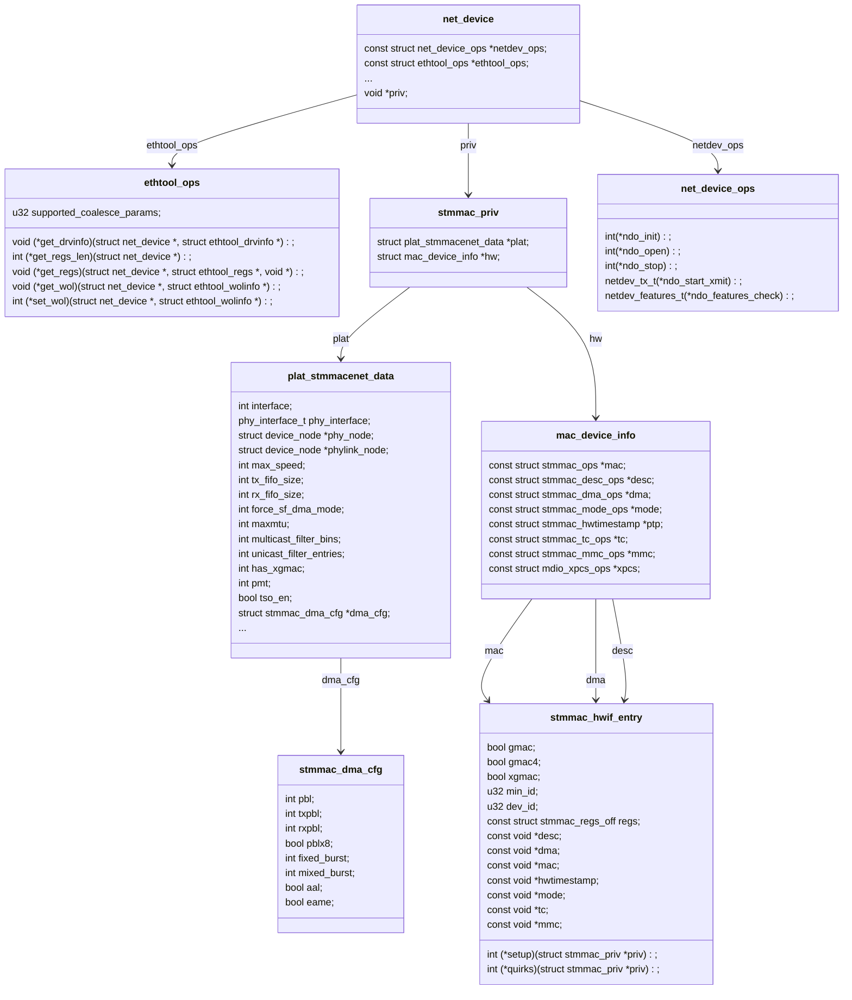

# 核心数据结构

```mermaid
classDiagram

    class plat_stmmacenet_data {
        int interface;
        phy_interface_t phy_interface;
        struct device_node *phy_node;
        struct device_node *phylink_node;
        int max_speed;
        int tx_fifo_size;
        int rx_fifo_size;
        int force_sf_dma_mode;
        int maxmtu;
        int multicast_filter_bins;
        int unicast_filter_entries;
        int has_xgmac;
        int pmt;
        bool tso_en;
        struct stmmac_dma_cfg *dma_cfg;
        ...
    }

    class stmmac_dma_cfg {
        int pbl;
        int txpbl;
        int rxpbl;
        bool pblx8;
        int fixed_burst;
        int mixed_burst;
        bool aal;
        bool eame;
    }


    class net_device {
        const struct net_device_ops *netdev_ops;
        const struct ethtool_ops *ethtool_ops;
        ...
        void *priv;
    }

    class ethtool_ops {
        u32	supported_coalesce_params;

        void	(*get_drvinfo)(struct net_device *, struct ethtool_drvinfo *);
        int	(*get_regs_len)(struct net_device *);
        void	(*get_regs)(struct net_device *, struct ethtool_regs *, void *);
        void	(*get_wol)(struct net_device *, struct ethtool_wolinfo *);
        int	(*set_wol)(struct net_device *, struct ethtool_wolinfo *);
    }

    class stmmac_priv {
        struct plat_stmmacenet_data *plat;
        struct mac_device_info *hw;
    }

    class mac_device_info {
        const struct stmmac_ops *mac;
        const struct stmmac_desc_ops *desc;
        const struct stmmac_dma_ops *dma;
        const struct stmmac_mode_ops *mode;
        const struct stmmac_hwtimestamp *ptp;
        const struct stmmac_tc_ops *tc;
        const struct stmmac_mmc_ops *mmc;
        const struct mdio_xpcs_ops *xpcs;
    }

    class stmmac_hwif_entry {
        bool gmac;
        bool gmac4;
        bool xgmac;
        u32 min_id;
        u32 dev_id;
        const struct stmmac_regs_off regs;
        const void *desc;
        const void *dma;
        const void *mac;
        const void *hwtimestamp;
        const void *mode;
        const void *tc;
        const void *mmc;
        int (*setup)(struct stmmac_priv *priv);
        int (*quirks)(struct stmmac_priv *priv);
    }

    class net_device_ops {
        int (*ndo_init);
        int (*ndo_open);
        int (*ndo_stop);
        netdev_tx_t (*ndo_start_xmit);
        netdev_features_t (*ndo_features_check);
    }

    plat_stmmacenet_data --> stmmac_dma_cfg : dma_cfg

    stmmac_priv --> plat_stmmacenet_data : plat
    stmmac_priv --> mac_device_info : hw

    net_device --> stmmac_priv : priv
    net_device --> ethtool_ops : ethtool_ops
    net_device --> net_device_ops : netdev_ops

    mac_device_info --> stmmac_hwif_entry : mac
    mac_device_info --> stmmac_hwif_entry : dma
    mac_device_info --> stmmac_hwif_entry : desc

        
```
